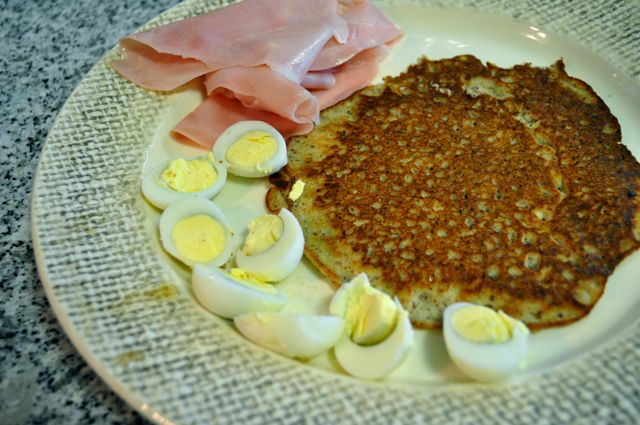

Ao fim de algumas tentativas, consegui finalmente fazer umas panquecas com ingredientes "permitidos". São muito simples de fazer mas requerem algum cuidado a virar visto que são mais frágeis que as panquecas tradicionais feitas com farinha de trigo.  
  
Foram feitas para o pequeno-almoço, acompanhadas de fiambre e ovos de codorniz. A receita não foi criada por mim mas já não sei de onde a retirei.  
  

  
Panquecas de Amêndoa e Coco  
**Ingredientes (3 panquecas médias)**  
Ovo, 1 grande  
Amêndoa com pele, 1/4 chávena (aprox. 50 gr)  
Leite de coco, 1/4 chávena (aprox. 55 gr)  
Canela, q.b.  
Manteiga para culinária, q.b.  
  
**Preparação**  

1. Picar 1/4 de chávena de amêndoas com pele para fazer farinha de amêndoa (pode-se usar a Bimby ou uma "picadora 1/2/3"). 
2. Juntar todos os ingredientes (menos a manteiga) e bater bem.
3. Aquecer uma frigideira em lume médio e derreter uma colher de manteiga.
4. Quando estiver bem quente, colocar uma porção de massa, inclinar a frigideira para espalhar a mistura e formar a panqueca com a espessura desejada.
5. Deixar cozinhar por 3 minutos ou até estar cozinhada do lado de baixo.
6. Virar com cuidado com uma espátula ou com a ajuda de um prato. Estas panquecas têm de ser viradas com maior delicadeza visto que quebram com facilidade.
7. Cozinhar do outro lado e servir bem quentes.
