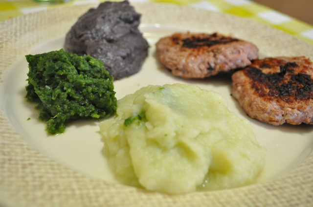

Ontem quando cheguei a casa, a Vânia tinha cozido uma couve-flor para acompanhar os [hambúrgueres](http://www.priberam.pt/dlpo/default.aspx?pal=hamb%C3%BArgueres) que estavam a grelhar.

  

Enquanto ela tratava da Inês, fiz uma experiência para dar um aspecto e sabor diferente aos ingredientes que fizeram parte do jantar.

  

O puré branco ficou bastante parecido com puré de batata. Da próxima vez vou experimentar adicionar uma gema de ovo e um pouco de noz moscada para tentar chegar ainda mais perto.

  

Deixo os detalhes.  
  

  

Puré Tricolor com Hambúrgueres

**Ingredientes (para 2 pessoas)**

Couve-flor média com folhas verdes, 1

Feijão preto cozido, 1 lata

Hambúrguer de porco ou vaca, 4

Sal, q.b.

Pimenta, q.b.

Azeite, q.b.

  

**Preparação**

1. Temperar os hambúrgueres com sal e pimenta. 
2. Cozer a couve-flor numa panela com água ou a vapor (a única preocupação é que fique bem cozida).
3. Aquecer um grelhador de fogão e colocar a carne a grelhar.
4. Com uma varinha mágica triturar apenas a parte branca da couve-flor. Rectificar temperos. Reservar.
5. Com uma varinha mágica triturar apenas as folhas verdes da couve-flor. Rectificar temperos.  Reservar.
6. Com uma varinha mágica triturar o feijão preto, com um pouco de água da cozedura da couve-flor para aquecer o puré. Rectificar temperos. Reservar.
7. Servir de imediato.

Depois de estar no prato, misturei os três purés, o que deu um aspecto visual interessante. Adicionei ainda umas gotas de limão (algo que adoro no puré de batata e que aqui deu um gosto especial).
