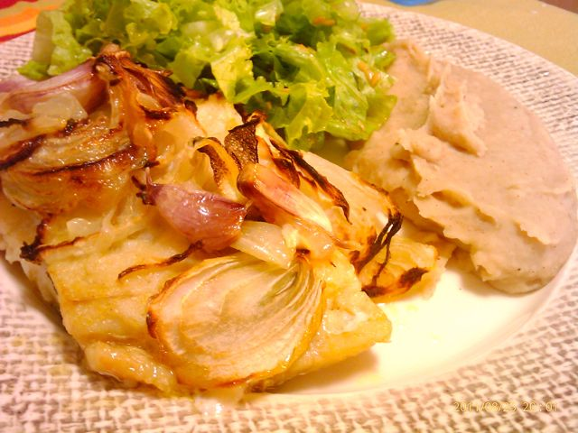

O jantar de hoje foi feito a meias. A Vânia tratou do bacalhau e eu do puré e salada. Fica a receita.  
  

  
  
Bacalhau no forno com puré de feijão branco e especiarias  
**Ingredientes (2 pessoas)**  
Bacalhau, 2 postas  
Cebolas, 2 grandes  
Alhos, 10 dentes  
Feijão branco cozido, 1 lata média  
Alface, 10 folhas  
Azeite, q.b.  
Pimenta, q.b.  
Canela em pó, q.b.  
  
**Preparação**  

1. Aquecer o forno a 180ºC.
2. Colocar o bacalhau num pirex com bastante azeite, a cebola cortadas às rodelas e os dentes de alho inteiros. Levar ao forno durante 1 hora aproximadamente.
3. Quanto o bacalhau estiver quase pronto, lavar e escorrer o feijão. 
4. Colocar o feijão numa taça com um pouco de água e passar com a varinha mágica.
5. Aquecer o puré de feijão no micro-ondas durante 3 minutos. Temperar com um fio de azeite, pimenta e canela em pó.
6. Acompanhar com uma salada de alface e sementes de linhaça.
