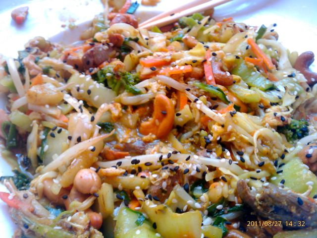
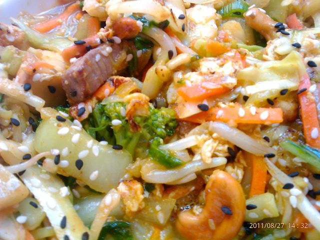

Hoje passámos o dia fora. O almoço foi no Forum Montijo... das cadeias de _fast-food_ escolhi a WOK TO WALK. O [menu](http://www.woktowalk.com/EAT/Our-Menu) permite variar bastante. Eu escolhi a base de vegetais com carne de vaca, caju e ananás, com molho Bangkok (caril com picante médio). O cozinheiro enganou-se e ainda adicionou um ovo. No fim "salpiquei" tudo com algumas sementes de sésamo.  
  
Nunca tinha comido nesta cadeia e fiquei surpreendido. O atendimento foi impecável, o prato estava bastante quente (como eu gosto) e super saboroso (ham ham).  
  

  

