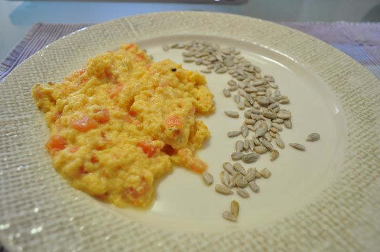

Ofereceram-me recentemente [A Enciclopédia da Culinária](http://www.wook.pt/ficha/enciclopedia-da-culinaria/a/id/10526924) que contém uma receita de ovos mexidos com tomate que fiz hoje para o pequeno-almoço. Fiz algumas alterações pontuais, substituindo o manjericão por tomilho (não tinha o primeiro) e usei a tecnica dos ["Ovos Sublimes" do Chef Ramsay](http://www.youtube.com/watch?v=dU_B3QNu_Ks).  
  

  

Ovos Mexidos com Tomate

**Ingredientes (para 1 pessoa)**

Ovos, 4

Tomate maduro, 1 médio

Manteiga, q.b.

Sal, q.b.

Pimenta, q.b.

Manjericão, 4 folhas

  

**Preparação**

1. Cortar o tomate em quartos. Retirar as sementes de cada quarto. Espalmar cada quarto do tomate e com uma faca cortar a pele (como se estivesse a descascar uma fatia de melão). 
2. Cortar os tomate limpo em cubos pequenos.
3. Bater os ovos e adicionar o manjericão picado.
4. Adicionar os cubos de tomate.
5. Mexer os ovos de acordo com a técnica dos ["Ovos Sublimes" do Chef Ramsay](http://www.youtube.com/watch?v=dU_B3QNu_Ks) (ou qualquer outra técnica... eu prefiro a primeira à tradicional).
6. Servir com algumas sementes de girassol.
