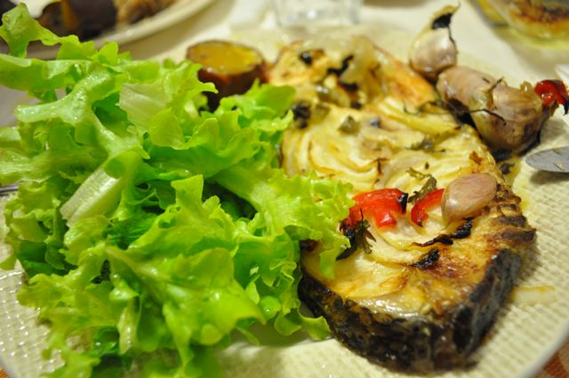

Hoje o jantar foi perca no forno com courgette e batata doce, feito pela Vânia. Eu só comi uma rodela pequena de batata, para provar. Já há algum tempo que em todos os assados de forno acrescentamos uma "mão-cheia" de dentes de alho, que depois de cozinhados ficam muito saborosos, combinando bem com peixe e carne. Acompanhámos com uma salada de alface e hortelã. Estava óptimo. Deixo a receita.  

  

  

  

Perca no forno com courgette e batata doce  

**Ingredientes (para 2 pessoas)**

Posta de perca congelada, 2

Cebola grande, 1

Batata doce, 2

Courgette, 1/2

Alhos, 10 dentes

Pimento vermelho, 1/4

Pimento verde, 1/4

Salsa, 1 ramo pequeno

Azeite, q.b.

Sal, q.b.

Pimenta, q.b.

  

**Preparação**

1. Pré-aquecer o forno a 180ºC.
2. Cortar a cebola às rodelas. Cortar os pedaços de pimento às tiras.
3. Cortar as batatas às rodelas. Cortar a courgette às rodelas.
4. Colocar um fio de azeite no fundo de um tabuleiro dee ir ao forno. Adicionar metade das rodelas de cebola.
5. Colocar o peixe no tabuleiro, colocando o resto da cebola por cima.
6. Dispor os restantes ingredientes no espaço livre do tabuleiro.
7. Temperar com sal e pimenta.
8. Regar com mais azeite.
9. Levar ao forno 60 minutos, aproximadamente.
10. Servir com uma salada de alface e hortelã.

  
**English Translation:** click [here](http://translate.google.pt/translate?sl=pt&tl=en&js=n&prev=_t&hl=pt-PT&ie=UTF-8&layout=2&eotf=1&u=http%3A%2F%2Fcozinhadecaverna.blogspot.com%2F2011%2F08%2Fdia-117-perca-no-forno-com-courgette-e.html%3Fv%3D0).
