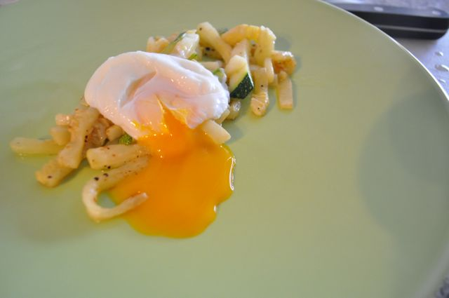
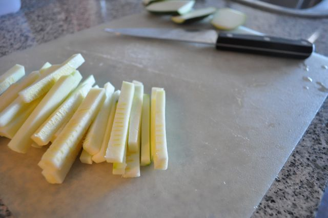

Hoje o meu pequeno-almoço (ou parte, visto que ainda comi umas fatias paio e um pouco de melão...) foi batonettes de courgette com ovo escalfado. Foi feita de cabeça a partir da receita do Chef Henrique Sá Pessoa no programa [Ingrediente Secreto](http://www.ingredientesecreto.tv/). Uma vez que não revi a receita recentemente, acabei por fazer de acordo com o que lembrava, o que resultou na simplificação de algumas coisas (o sabor ficou bom de qualquer das formas...). A receita original pode ser encontrada [aqui](http://www.youtube.com/watch?v=ELfm4_7DmZ8).  
  

  

  
Batonettes de courgette com ovo escalfado (simplificada)  
**Ingredientes (para 1 pessoa)**  
Courgette, 1 média  
Ovos, 2  
Sal, q.b.  
Pimenta, q.b.  
Azeite, q.b.  
Manteiga, q.b.  
  
**Preparação**  

1. Cortar a courgette em batonettes (ver imagem em baixo).
2. Aquecer um pouco de manteiga e um fio de azeite numa frigideira.
3. Adicionar os batonettes e temperar com sal e pimenta. Saltear.
4. Entretanto, escalfar os ovos em água a ferver com um pouco de vinagre (1 parte para 10 de água, de acordo com o [original](http://www.youtube.com/watch?v=ELfm4_7DmZ8), que explica muito bem em detalhe como escalfar um ovo).
5. Servir as batonettes de courgette com os dois ovos escalfados.

  

