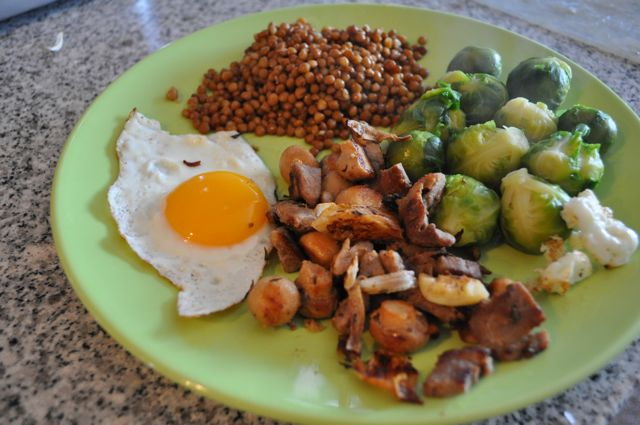

Um dia desta semana, durante a manhã, tive de trabalhar de casa e tomar conta da Inês. Com tanta coisa para fazer (dar-lhe lanche, "graçolas", mudança de fraldas, aquecer-lhe a sopa, trabalhar, etc., etc.) o almoço antes de ir sair de casa foi feito a correr, muito a correr e muito, muito improvisado. Fica a receita.

  

  

Lombinhos com cogumelos, couves de Bruxelas, lentilhas e um ovo estrelado

**Ingredientes (para 2 pessoas)**

Lombinho de porco, 1

Cogumelos pequenos, 1 lata

Couves de bruxelas congeladas, 400 gr.

Lentinhas cozidas, 1 lata pequena

Ovos, 2

Azeite, q.b.

Vinagre, q.b.

Sal, q.b.

Pimenta, q.b.

Tomilho, q.b.

  

**Preparação**

1. Cozer as couves de Bruxelas em água a ferver, com sal.
2. Cortar o lombinho em pedaços pequenos (no meu caso foi a unica forma de o cozinhar visto que estava congelado).
3. Lavar e escorrer os cogumelos.
4. Aquecer um fio de azeite numa frigideira e adicionar os cogumelos e os lombinhos. Temperar com sal e pimenta moída no momento. Perfumar com o tomilho e saltear em lume médio.
5. Quando a carne estiver praticamente cozinhada, arranjar espaço na frigideira e estrelar um ovo (cuidado para não pegar...).
6. Lavar e escorrer as lentilhas, que podem ser aquecidas no micro-ondas.
7. Servir tudo junto, temperando as couves de Bruxelas com um fio de azeite e um pouco de vinagre.
