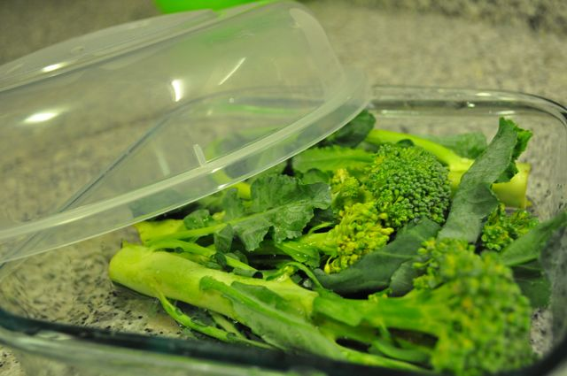
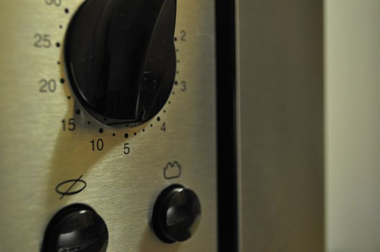

Queria encontrar uma forma de cozer legumes rápidamente para o pequeno-almoço visto que muitas vezes não os consigo comer nesta altura do dia porque demoram a preparar. Fiz o teste com brócolos cozidos no micro-ondas para ver se resultava.  
  
Bastou colocar os brócolos cortados em pedaços num recipiente que possa ser usado no micro-ondas, adicionar meio copo de água e programar 10 minutos na potência máxima (que é o tempo de tomar banho de manhã...).  
  
Os brócolos ficaram com menos água do que é normal e com uma textura um pouco diferente mas mesmo assim estavam comestíveis.  
  

  

