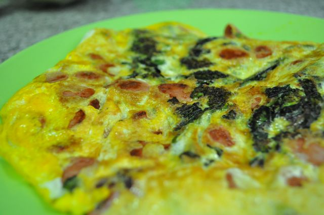
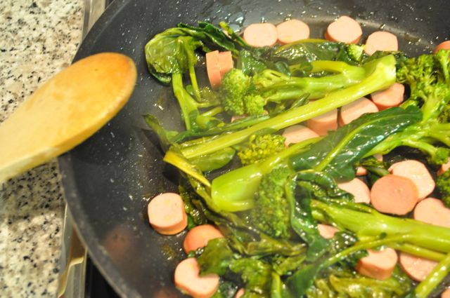

Com os brócolos cozidos no micro-ondas e com umas [salsichas novas](http://2.bp.blogspot.com/-Nguq-2WEx3o/TmPnTvfXHwI/AAAAAAAAEWo/Tpeg5zsW_8U/s1600/Cozinha+de+Caverna+-+626.jpg) para experimentar (ver página de [Produtos](http://cozinhadecaverna.blogspot.com/p/produtos.html) para mais detalhes), fiz uma omelete.  

  

  
Omelete de brócolos e salsichas  
**Ingredientes (para 1 pessoa)**  
Ovos, 3  
Brócolos, 250 gr  
Salsichas, 3  
Sal, q.b.  
Pimenta, q.b.  
Azeite, q.b.  
  
**Preparação**  

1. Cozer os brócolos (por exemplo, no [micro-ondas](http://cozinhadecaverna.blogspot.com/2011/09/dia-125-brocolos-cozidos-no-micro-ondas.html)).
2. Aquecer um fio de azeite numa frigideira.
3. Saltear os brócolos cozidos e as salsichas cortadas em rodelas.
4. Bater os ovos e adicionar aos brócolos e salsichas, agitando a frigideira para que fiquem bem espalhados pela base.
5. Cozinhar 1 ou 2 minutos.
6. Virar com a ajuda de um prato.
7. Cozinhar mais 1 ou 2 minutos.
8. Servir com uma peça de fruta.

  
  

