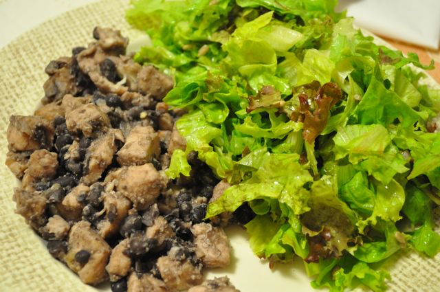

Hoje joguei uma partida de futebol com uns colegas do trabalho. Já não jogava há muito tempo pelo que foi bastante porreiro. No fim do jogo, como comi apenas umas amêndoas antes de ir jogar, senti arrepios e tremores, provavelmente por falta de [açúcar no sangue](http://pt.wikipedia.org/wiki/Hipoglicemia). Recuperei depois de comer lentilhas, amêndoas, gelatina, fruta, iogurte natural, chocolate 85% cacau e um café (abusei um pouco mas estava mesmo a necessitar...). Fica o alerta para quem segue uma dieta destas e não se alimenta convenientemente antes de praticar desporto intenso.  
  
Hoje para o jantar, a Vânia fez uma versão modificada do [Feijão Açoreano da Cristina](http://www.vaqueiro.pt/receitas/detalhe/1980/feijao-acoreano-da-cristina) (clicar para ver os detalhes). Basicamente não usou ketchup nem caldo de galinha e substituiu o feijão manteiga por feijão preto (que era o que tínhamos cá em casa). Acompanhámos com uma salada de alface com sementes de girassol. Não ficou com o melhor aspecto pois secou um pouco mas estava muito saboroso, com um leve toque a canela.  
  
Este prato é fantástico para fazer no Inverno (naqueles dias de chuva, para comer na sala com uma manta) mas com a salada para refrescar ficou um bom prato de fim de Verão.  
  

