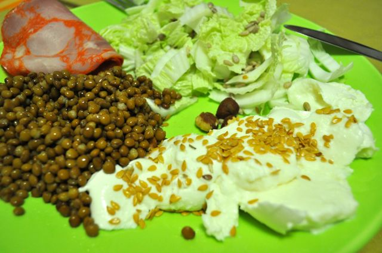
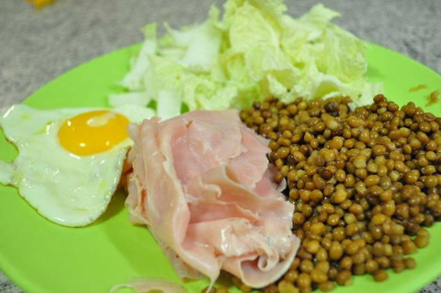

Mais dois pequenos almoços "slow-carb", com algumas semelhanças.

  

Paio York, lentilhas, [acelga](http://2.bp.blogspot.com/_KafQpwsq4TA/S-hyY9kgHRI/AAAAAAAAJQ8/GXNisGc7W7M/s1600/acelga.jpg) cortada em tiras, mozzarella de bufala, sementes de linhaça, avelãs e sementes de girassol.

  
Ovo estrelado, acelga cortada em tiras, fiambre e lentilhas. Os pedacinhos de caule da acelga são excelentes para comer com a gema do ovo.  

