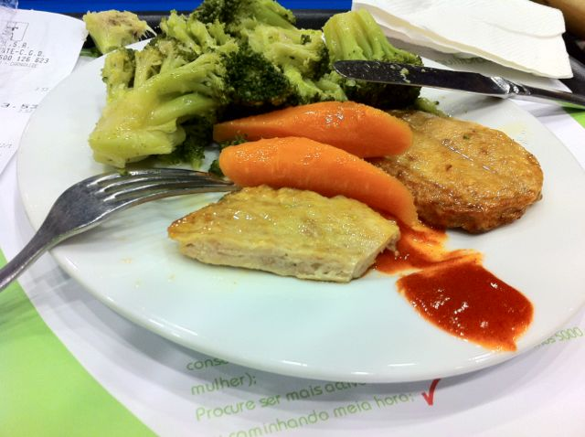

Deixo uma sugestão para quem almoça fora de casa (restaurante, cantina, etc.)  
  
O almoço de hoje foi hamburger de aves com brócolos e cenoura. Temperado com azeite e vinagre, acompanhado de um pouco de molho picante.  
  

