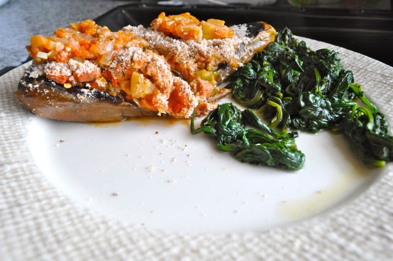
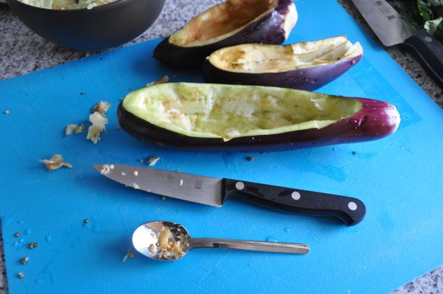
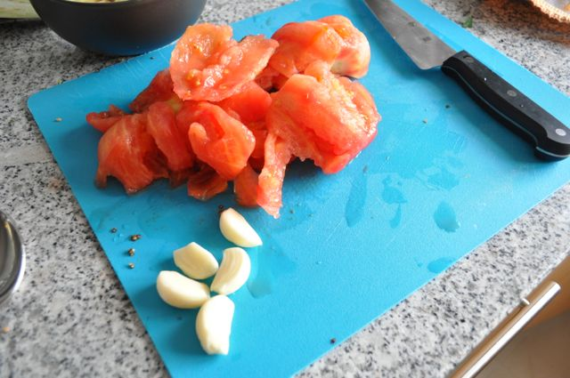

No fim-de-semana aproveitei as beringelas que tinham vindo no cabaz do [Prove](http://www.prove.com.pt/) e fiz uma receita que encontrei no Mark's Daily Apple ([esta](http://www.marksdailyapple.com/stuffed-eggplant-recipe/)). Alterei um pouco os ingredientes, usando um resto de salsichas e carne picada. As beringelas necessitavam de ficar um pouco mais bem cozinhadas mas não ficou mau (apesar da Vânia não ter gostado muito...).  
  

  
Beringelas Recheadas com Espinafres Salteados  
**Ingredientes (para 2)**  
beringelas pequenas, 3  
cebola picadas, 2  
dentes de alho picados, 5  
tomates picados (sem pele e grainhas), 3  
tomilhos, 1 c. chá  
pimenta, 1 c. chá
  
salsichas picadas, 4  
hamburger desfeito, 1  
farinha de amêndoa, 1 c. sopa  
espinafres, 1 molho  

azeite, 5 c. sopa

vinagre, q.b.

sal, q.b.  
pimenta, q.b.  
  
**Preparação**  

1. Cortar as beringelas longitudinalmente. Retirar o miolo com uma colher, cortar em pedaços pequenos e reservar.
2. Aquecer metade do azeite numa frigideira e cozinhar as beringelas com a abertura para baixo (durante 5 minutos aproximadamente). Colocar num tabuleiro para ir ao forno.
3. Colocar o resto do azeite numa frigideira e saltear a cebola e o alho. 
4. Adicionar os restantes ingredientes (com excepção da farinha) e deixar cozinhar até ficar apurado.
5. Rechear as beringelas com a mistura e cobrir com a farinha de amêndoa.
6. Levar ao forno aquecido a 200ºC durante 15 a 20 minutos.
7. Servir com espinafres salteados.

  

