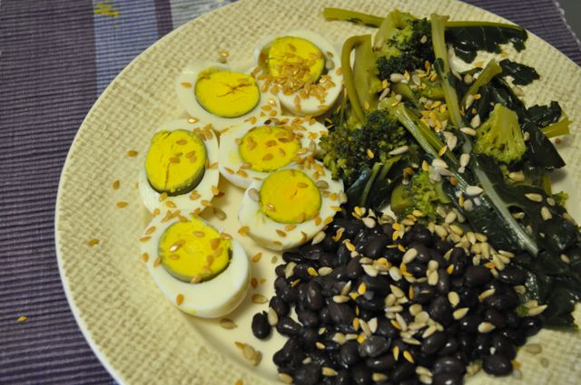

Mais um pequeno-almoço "slow-carb": brócolos e ovos cozidos com feijão preto.  
  
Foi confeccionado durante a noite, programando o fogão durante 30 minutos para cozer os ovos e os brócolos. Coloquei uma tampa e baixa temperatura (para não sair água da panela) para que de manhã ainda estivesse morno.  
  
Temperei com azeite e vinagre e salpiquei com sementes de sésamo e linhaça.  
  

