Estou cada vez mais fã do [Prove](http://www.prove.com.pt/projecto), que já tenho referido em alguns _posts_. Basicamente consiste num projecto de apoio a agricultura local, através do qual agricultores de determinadas zonas do País vendem cabazes de vegetais e fruta por 10€.  
  
Recentemente tenho ido directamente à exploração buscar o cabaz, tendo conhecido os produtores que são impecáveis. Recomendo vivamente!!  
  
Deixo os detalhes de um cabaz, cujos componentes foram apanhados um par de horas antes de eu ter chegado à quinta.  
  

O cabaz completo

[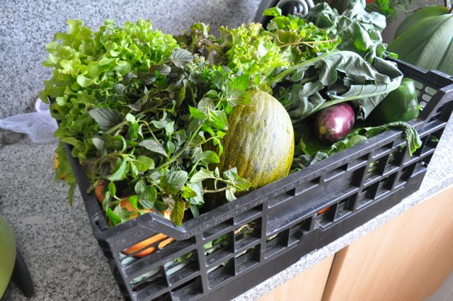](http://2.bp.blogspot.com/-zbe_i7wSpgY/Toi_giTOUUI/AAAAAAAAEXk/sJxVFP11XfM/s1600/DSC_1675.jpg)

Melão pequeno

[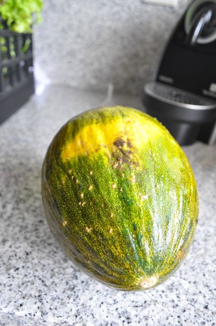](http://3.bp.blogspot.com/-ULok6woE8ks/Toi_hHWesSI/AAAAAAAAEXo/GeE6F1CmlS4/s1600/DSC_1678.jpg)

  

Alfaces

[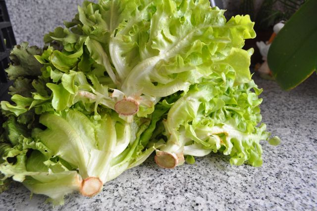](http://1.bp.blogspot.com/-e-gdw14Aky4/Toi_hY_8ElI/AAAAAAAAEXs/2CwILjZapGM/s1600/DSC_1679.jpg)

  

Brócolos

[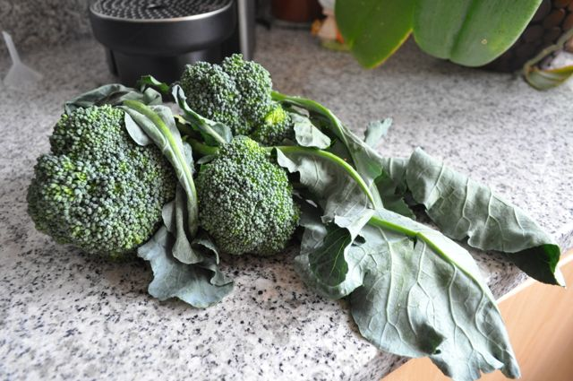](http://1.bp.blogspot.com/-eeWl0Wubb-4/Toi_h3AA6HI/AAAAAAAAEXw/870MK-rWOp4/s1600/DSC_1680.jpg)

  

Beringela

[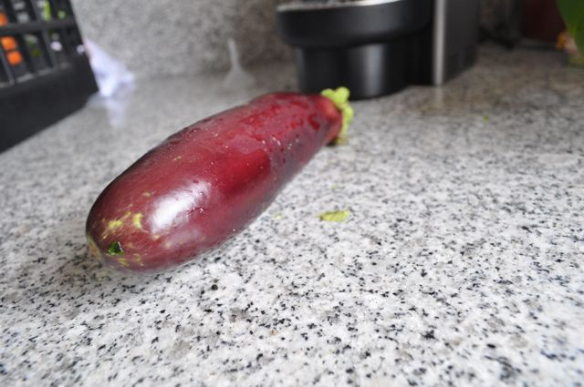](http://1.bp.blogspot.com/-XB4QfEdSpBo/Toi_iaf0z9I/AAAAAAAAEX0/-glnYDrdkMQ/s1600/DSC_1681.jpg)

  

Couve Portuguesa e Nabiças 

[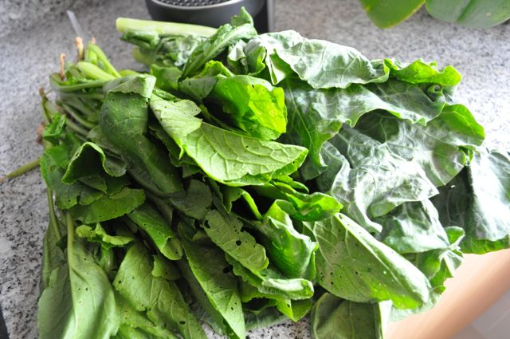](http://3.bp.blogspot.com/-rmm4gJyzv4o/Toi_i2LleTI/AAAAAAAAEX4/Sq96DJ_abJo/s1600/DSC_1682.jpg)

  

Tomates 

[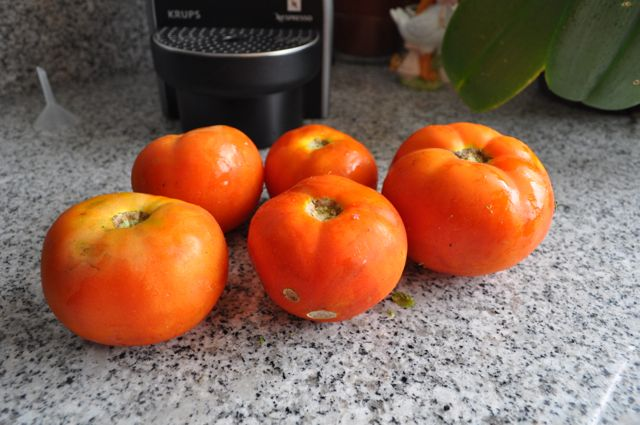](http://2.bp.blogspot.com/-RWw2wKRtuTk/Toi_jCpc3JI/AAAAAAAAEX8/cNMxf6Wg-Tk/s1600/DSC_1683.jpg)

  

Pimento, nabos, courgette, alhos francês e cenouras 

[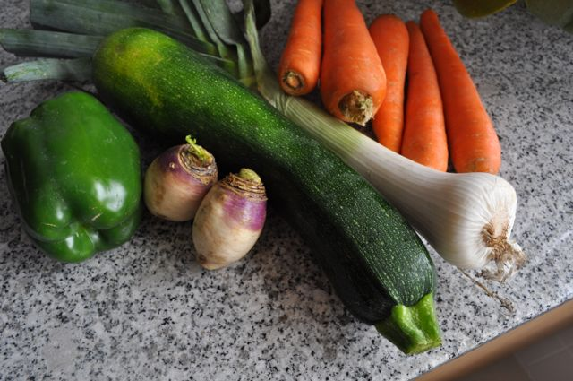](http://3.bp.blogspot.com/-jSsRMLqMAOc/Toi_jq5GktI/AAAAAAAAEYA/spoIkAQnqLs/s1600/DSC_1685.jpg)

  

Maçãs 

[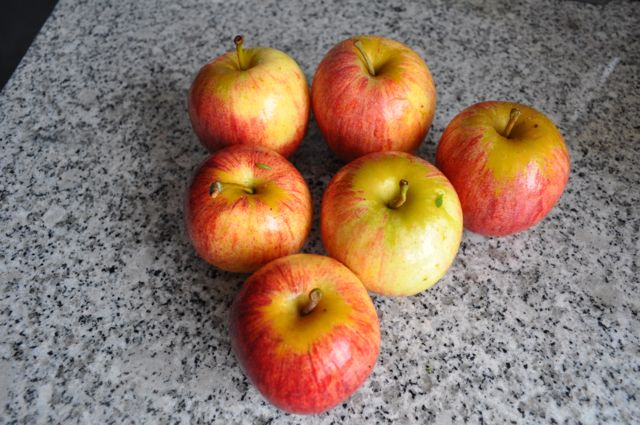](http://2.bp.blogspot.com/-N1zRnWw-B8U/Toi_jwGwWpI/AAAAAAAAEYE/9XiBEoqb4u4/s1600/DSC_1686.jpg)

  

Cebolas e couve roxa

[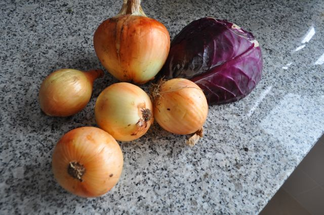](http://3.bp.blogspot.com/-z2mf4OX-8RA/Toi_kL2uXCI/AAAAAAAAEYI/FSHGj3l3c7k/s1600/DSC_1687.jpg)

  

Salsa, coentros e hortelã 

[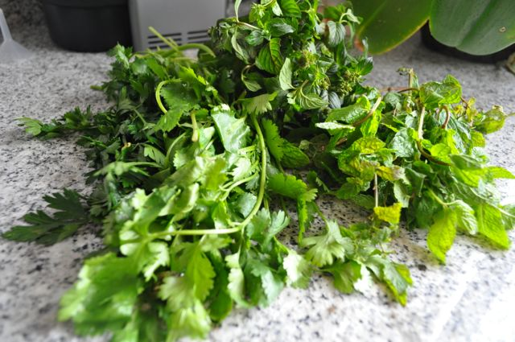](http://1.bp.blogspot.com/-ypVO5YwxocU/Toi_kmnfxpI/AAAAAAAAEYM/KvYGsIFfvZM/s1600/DSC_1688.jpg)
