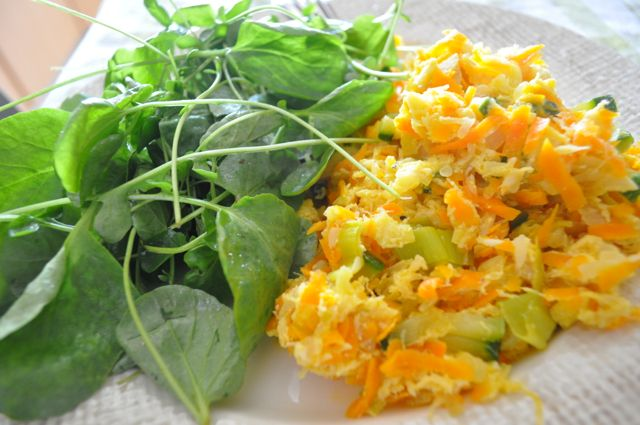

Ontem para o almoço fizemos bacalhau cozido com couves. Uma vez que tinha cozido umas postas a mais, e a Vânia andava com "desejo" de bacalhau à Brás, fiz uma versão adaptada da receita, que não levou batatas.

  

  
Legumes e bacalhau à Brás com salada de agrião  
**Ingredientes (para 2 pessoas)**  
Bacalhau cozido, 2 postas  
Courgette, 1  
Cenouras, 2  
Alho francês, 2  
Ovos, 4  
Cebolas, 2  
Alho, 2 dentes  
Agriões, 2 punhados  
Azeite, q.b.  
Sal, q.b.  
Pimenta, q.b.  
  
**Preparação**  
  

1. Desfiar o bacalhau.
2. Cortar a courgette em palitos pequenos.
3. Ralar as cenouras.
4. Cortar o alho francês às rodelas finas.
5. Picar a cebola e o alho.
6. Aquecer uma frigideira com 2 colheres de sopa de azeite. Adicionar a cebola e o alho, refogando até a cebola começar a ficar transparente.
7. Adicionar a cenoura, o alho francês e a courgette. Temperar com sal e pimenta. Deixar estufar com uma tampa. Quando os legumes estiverem quase cozidos, retirar a tampa para que o liquido dos legumes evapore (caso contrário o resultado final vai ficar muito aguado).
8. Adicionar o bacalhau e deixar cozinhar 2 ou 3 minutos.
9. Bater os ovos numa taça e temperar com sal.
10. Adicionar os ovos ao bacalhau e aos legumes, deixar cozinhar os ovos, mexendo sempre.
11. Servir com uma salada de agrião e azeitonas.

  
**English Translation**: click [here](http://translate.google.com/translate?u=http%3A%2F%2Fcozinhadecaverna.blogspot.com%2F2011%2F10%2Fdia-150-legumes-e-bacalhau-bras-com.html%3Fv%3D0&sl=pt&tl=en&hl=&ie=UTF-8).
