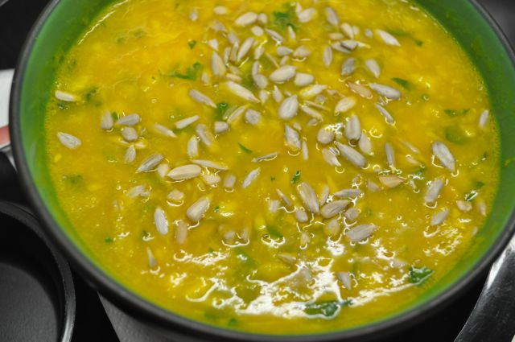

This recipe in English: click [here](http://translate.google.pt/translate?hl=pt-PT&sl=pt&tl=en&u=http%3A%2F%2Fcozinhadecaverna.blogspot.com%2F2011%2F10%2Fdia-150-sopa-de-legumes-e-peixe.html%3Fv%3D0).

  

Deixo a receita do jantar de hoje: sopa de legumes e peixe, seguida de uma gelatina.

  

  

Sopa de Legumes e Peixe

**Ingredientes (para 4 pessoas)**

Cenouras, 3

Nabo, 1

Cebolas, 2

Alho, 3 dentes

Chuchu, 1

Courgette pequena, 1

Lombos de pescada congeladas, 400 gr

Salsa picada, 2 colheres de sopa

Coentros picados , 2 colheres de sopa

Hortelã picada, 2 colher de sopa

Água, 1 litro

Sal, q.b.

Azeite, q.b

  

**Preparação**

1. Cozer o peixe em metade da água e sal.
2. Descascar todos os legumes, cortar em pedaços pequenos.
3. Cozer com metade da água, temperada com sal (Bimby: 25 minutos, velocidade 1, 100ºC). 
4. Triturar tudo com uma varinha mágica (Bimby: 2 minutos, velocidade 7).
5. Adicionar a água do peixe até o creme ter a consistência desejada. 
6. Rectificar os temperos.
7. Desfiar o peixe e adicionar ao creme.
8. Adicionar as ervas aromáticas e deixar levantar fervura (Bimby: 3 minutos, velocidade 1, 100ºC).
9. Servir com algumas sementes de girassol.
