  
Há duas semanas estive dois dias em formação em Londres. A título de exercício, fiz os possíveis para manter a dieta dentro do normal. Na prática podia ter “relaxado” um pouco na dieta mas quis perceber o quão fácil seria mantê-la. Deixo alguns detalhes.  
  
Antes de sair de casa:  
  

- Preparei um saco generoso com sementes de girassol e abóbora.
- Procurei um supermercado de produtos biológicos perto do hotel para aumentar a probabilidade de conseguir arranjar comida saudável (encontrei o [Organic Planet](http://www.planetorganic.com/), a 10 minutos de distância a pé).

O voo de ida coincidiu com a hora de jantar e, uma vez que viajei pela TAP, a refeição estava incluída. Quando fiz a reserva da viagem, não pedi alteração de menu (algo que é possível na maioria das companhia aéreas), o que me levou a arranjar um plano alternativo. A solução (em cima do joelho) que arranjei passou por comprar um pequeno queijo no aeroporto, para comer com sementes de girassol e abóbora que levei de casa. No avião limitei-me a pedir um copo de vinho tinto.  
  
Por acaso a sandes na TAP até nem se revelou ser má de todo: era de atum com alface e tomate, pelo que ainda comi o recheio da mesma, deixando apenas o pão.  
  
[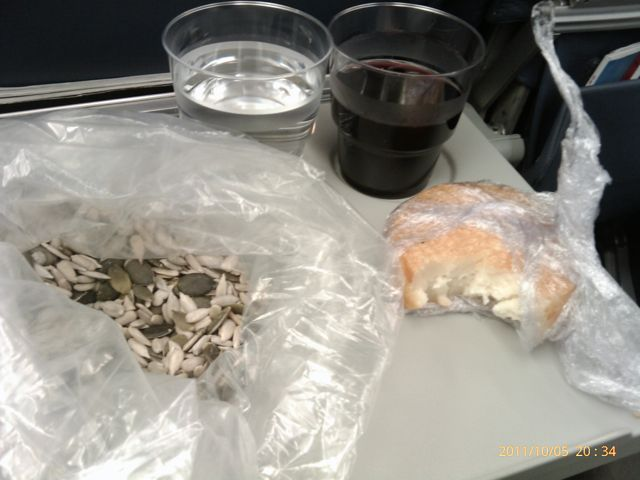](http://4.bp.blogspot.com/-6jd8wp2XMBg/TptLBMZ7f4I/AAAAAAAAEYc/i-JqKzreWa4/s1600/IMAG0449.jpg)  
  
Cheguei ao hotel já perto das 0h. Bebi um chá e fui dormir.  
  
Nesse dia tomei o pequeno-almoço no hotel, tendo comido ovos e bacon, que acompanhei com cogumelos, tomate e café.  

[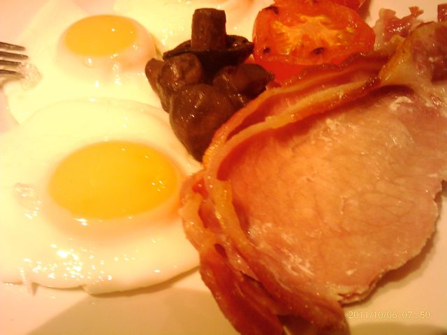](http://3.bp.blogspot.com/-JrNXfVL1s_4/TptLB0AKcrI/AAAAAAAAEYk/juSWTRccH6U/s1600/IMAG0451.jpg)

  
Como a formação começava às 9h, ainda tive tempo para passar no Organic Planet, para comprar alguns snacks (estive numa formação semelhante o ano passado e a comida tipicamente quase só bolos e pão, pelo que quis estar prevenido para um eventual repetição da organização). O Organic Planet tem muita variedade de comida tendo sido fácil encontrar iogurtes de cabra e ovelha (os mesmos que costumo comprar em Portugal) e umas barras feitas à base de frutos secos.  
  
Por surpresa minha, este ano, a organização da formação tinha snacks mais saudavéis: para além do pão e bolos, existia uma variedade interessante de fruta (kiwi, morangos, framboesas, uvas, bananas, meloa, etc.).  
  
Durante a manhã comi algumas das sementes que tinha levado de casa, framboesas e morangos.  
  
O almoço estava incluído na formação. Da variedade de coisas que estavam disponíveis, consegui montar um prato decente: espetadas de frango com salada mista, regada com um iogurte de ovelha que tinha trazido do Organic Planet. Nada mau.  
  

[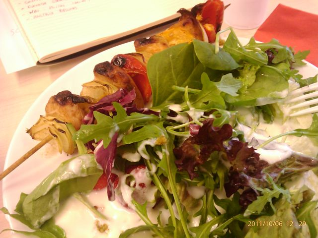](http://4.bp.blogspot.com/-69ROZ5E3R8k/TptLCXRJfLI/AAAAAAAAEYs/NaNA3e6s04M/s1600/IMAG0452.jpg)

  
Quando terminei a refeição, fui apanhar um pouco de ar (que já está bem fresco nesta altura em Inglaterra) e beber um expresso no Caffé Nero.  
  

[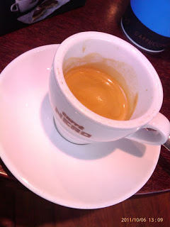](http://1.bp.blogspot.com/-f-_zRr_0T78/TptLC9XvEXI/AAAAAAAAEY0/XGCcyUcpbNM/s1600/IMAG0453.jpg)

  
Durante a tarde, comi algumas framboesas, sementes e uma barra Nakd de maçã.  
  

[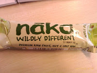](http://4.bp.blogspot.com/-pcSbnkrWTnM/TptLDWvLz6I/AAAAAAAAEY8/Po-zWPaKDDY/s1600/IMAG0454.jpg) [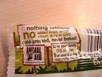](http://3.bp.blogspot.com/-hipVvYaLYBs/TptLEl_L0WI/AAAAAAAAEZM/cqX6tUN8AEM/s1600/IMAG0456.jpg)

  

[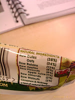](http://3.bp.blogspot.com/-o7_tIYQ_TNI/TptLDxOuUbI/AAAAAAAAEZE/tDGofPxvSHg/s1600/IMAG0455.jpg)

  
No final da formação, o grupo juntou-se num wine bar para descontrair, onde comi sementes (para evitar as batatas fritas de pacote), fiambre, presunto, azeitonas e algumas batatas fritas normais, tudo acompanhado de vinho tinto (chileno, que não era grande coisa...). Saí um pouco da linha mas nada de especial.  Já não jantei. Bebi um chá, vi um documentário e fui dormir.  
  
No segundo dia tomei o pequeno-almoço no Organic Planet: um iogurte de ovelha estilo grego com sementes e uma barra Nakd, desta vez de com caju.  
  

[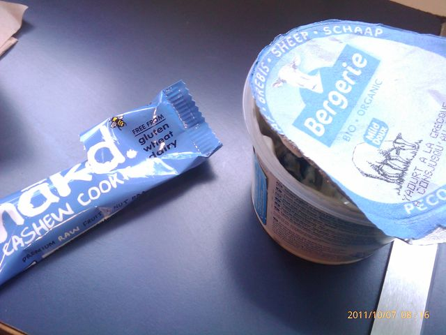](http://3.bp.blogspot.com/-wE4Tx256eEY/TptLFFGfa1I/AAAAAAAAEZU/HK4v831Zgoc/s1600/IMAG0457.jpg)

  
Durante a manhã, comi algumas sementes e um pouco de fruta.  
  

[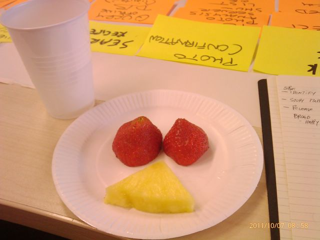](http://3.bp.blogspot.com/-GdHVH3Zmb04/TptLFn6CXWI/AAAAAAAAEZc/-E2Hh6hqDzE/s1600/IMAG0458.jpg)

  
O almoço foi semelhante ao do dia anterior, mas desta vez também haviam espetadas vegetarianas, pelo que comi uma destas e uma de carne, com vegetais crus e ovo que retirei de uma sandes.  
  

[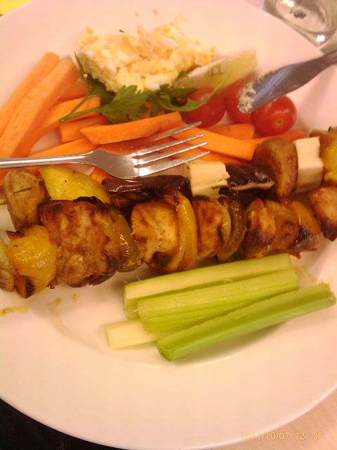](http://3.bp.blogspot.com/-bDWaIvYBSlY/TptLGGSgivI/AAAAAAAAEZk/Oweg8GLqBrI/s1600/IMAG0459.jpg)

  
Durante tarde, comi morangos e figo. São hidratos de carbono a mais mas no fim da formação fui dar uma caminhada de duas horas, o que deve ter compensado...  
  
Terminei a noite no Nando’s, com meio frango picante, uma salada Mediterrânea e uma maçaroca de milho (mais hidratos.... mas fui caminhar 30 minutos depois). Estava tudo maravilhoso. Caffé Nero para um expresso.  
  

[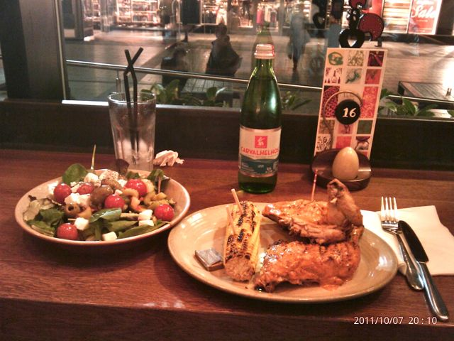](http://1.bp.blogspot.com/-sXR_uk7WupU/TptLKpMmrWI/AAAAAAAAEak/hzVbpFG03Ok/s1600/IMAG0467.jpg)

  
O voo de regresso foi no Sábado, às 6 a.m., o que me obrigou a acordar às 2 a.m. Até chegar ao avião comi dois iogurtes de ovelha (que comprei no Organic Planet) com sementes, uma barra Nekd e um café de saco no PRET.  
  
Resumo: a formação foi boa e consegui manter o plano alimentar sem grandes estragos, principalmente graças às sementes e ao Organic Planet.  
  
É bom estar de volta a casa (as saudades das senhoras lá de casa já apertavam...).
