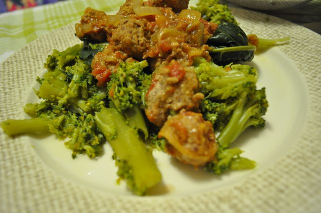
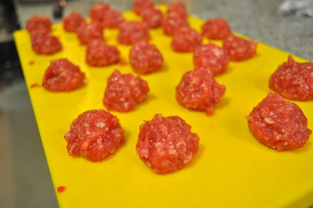
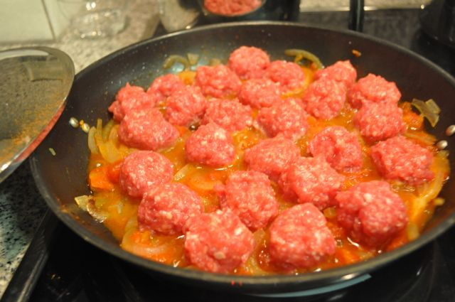

Hoje acordei a pensar em almôndegas (imagine-se). Não fiz para o almoço porque a Vânia não lhe apetecia mas ao jantar não escapou. Inventei um bocado e fiz umas almôndegas "anãs" com especiarias, acompanhadas de brócolos cozidos. Fica a receita.  
  

  
Almôndegas anãs com especiarias e brócolos  
  
**Ingredientes (2 pessoas)**  
Carne picada de porco, 200 gr.  
Carne picada de vaca, 200 gr.  
Tomate em pedaços, 1 lata média  
Cebola, 1 média  
Ovo, 1  
Canela, 1 c. chá  
Pimenta da Jamaica, 5 grãos  

Sal, q.b.

Pimenta moída, q.b.

Azeite, 2 c. sopa

Água, q.b.

  

**Preparação**  

1. Temperar a carne com sal e pimenta moída no momento. Adicionar o ovo e misturar tudo.
2. Cortar a cebola em meias luas.
3. Aquecer o azeite numa frigideira com tampa. Adicionar a cebola e deixar alourar.
4. Escorrer o liquido do tomate e adicionar os pedaços à cebola. Adicionar a pimenta da jamaica.
5. Tapar e deixar cozinhar em lume brando.
6. Fazer bolas pequenas de carne (do tamanho de uma noz, aproximadamente). Como esta receita não leva nenhum elemento que ajuda a ligar a carne, como a farinha, pode ser um pouco mais difícil de formar as almôndegas. Fazê-las pequenas ajuda.
7. Adicionar a carne ao tomate e cebola, tapar e deixar cozinhar em lume médio/baixo.
8. Mexer de vez em quando. Se o molho secar, adicionar um pouco de água.
9. Quando a carne estiver quase pronta adicionar a canela e mexer bem.
10. Cozinhar a carne completamente e servir com brócolos cozidos.

  

