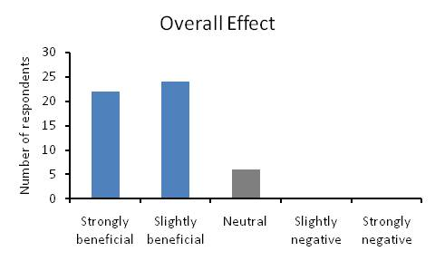

Deixo dois _links_ para um estudo interessante sobre o impacto de uma dieta sem glúten durante 1 mês.  
  
Parte 1 - Demografia  
[http://wholehealthsource.blogspot.com/2011/03/gluten-free-january-survey-data-part-i.html](http://wholehealthsource.blogspot.com/2011/03/gluten-free-january-survey-data-part-i.html)  
  
Parte 2 - Resultados  
[http://wholehealthsource.blogspot.com/2011/03/gluten-free-january-survey-data-part-ii.html](http://wholehealthsource.blogspot.com/2011/03/gluten-free-january-survey-data-part-ii.html)  
  
As conclusões apontam para melhorias em todas as categorias de saúde medidas: peso, "questões" intestinais (trânsito, flatulência, etc.), fadiga e ansiedade, entre outros.  
  

(fonte: [http://wholehealthsource.blogspot.com](http://wholehealthsource.blogspot.com/2011/03/gluten-free-january-survey-data-part-ii.html))
