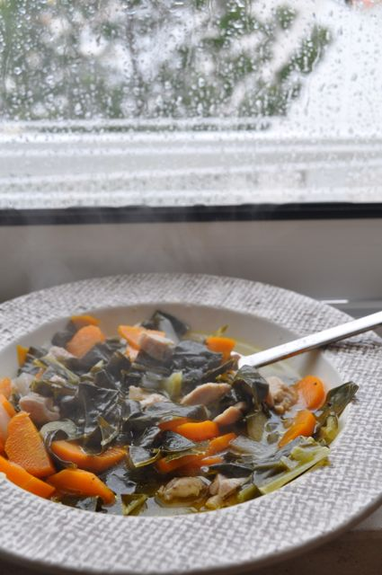

Chegou o mau tempo. Depois de termos dormido até tarde, acordei com vontade de comer uma sopa reconfortante. Uma vez que a Vânia queria tomar um pequeno-almoço "normal", inventei o meu almoço (já tinha tomado o pequeno quando a Inês bebeu o leite...): uma de sopa da pedra minimalista. Foi uma excelente opção para comer no sofá, com roupa quente. Ainda sobrou para o jantar.  
  

  
Sopa da pedra minimalista  
  
**Ingredientes (2 pessoas)**  
Cebola pequena, 1  
Água quente, 1/2 litro  
Carne de porco, 150 gr.  
Cenoura, 1  
Couve, 1 folha grande  
Nabo pequeno, 1  
Azeite, q.b.  
Sal, q.b.  
Pimenta, q.b.  
  
**Preparação**  

1. Cortar a carne em tiras pequenas.
2. Aquecer uma colher de sopa de azeite num tacho pequeno.
3. Picar a cebola adicionar ao azeite. 
4. Quando estiver translúcida, saltear a carne ligeiramente, temperando com sal e pimenta.
5. Entretanto, cortar a cenoura às rodelas, o nabo em palitos pequenos e a couve em tiras da largura de um dedo.
6. Adicionar a água quente à carne e os legumes.
7. Colocar uma tampa no tacho e deixar cozinhar em lume brando.
8. Comer bem quente.
