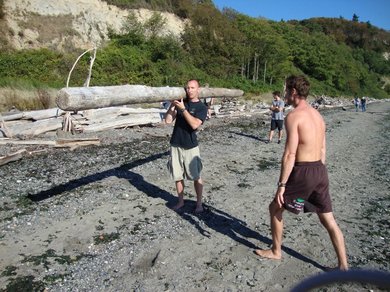

  
Descobri recentemente o MovNat, um movimento de _fitness_ muito interessante, que é, de uma perspectiva simplista, o equivalente da dieta "tipo" caçador-recolector, mas aplicado ao exercício físico: aquele que é natural para o ser humano.  
  
Deixo alguma informação adicional, que pode ser complementada através do _[site](http://movnat.com/)_ do MovNat.  
  
Estou em contacto com os responsáveis por este movimento para se organizar uma _workshop_ em Portugal. Ainda durante esta semana darei mais novidades. Os interessados podem contactar-me através do e-mail [cozinhadecaverna@gmail.com](mailto:cozinhadecaverna@gmail.com).  
  
O que é o MovNat?  
**O MovNat é um conceito de _fitness_ natural baseado inteiramente na prática de movimentos naturais**, aqueles que são necessários à sobrevivência do ser humano num ambiente selvagem:  
  

- Andar
- Correr
- Saltar
- Equilibrar-se
- Rastejar
- Trepar
- Elevar-se
- Carregar/Transportar
- Lançar
- Apanhar
- Nadar
- Defender-se

  
Este método permite o desenvolvimento de competências e práticas mentais e físicas que são benéficas e úteis para o dia-a-dia ou em situações difíceis.  **O MovNat é um sistema educacional que permite reaprender os princípios ancestrais de vida natural para trazer a vitalidade e bem estar para o mundo moderno.**  
  

  

  
MovNat e a dieta Caçador-Recolector/Paleo/Primitiva  
A dieta Caçador-Recolector/Paleo/Primitiva assenta nos princípios alimentares que os humanos tinham quando ainda eram caçadores-recolectores. É suportada por diversos estudos científicos e está a tornar-se cada vez mais popular devido às rápidas melhorias que fornece em termos de saúde e vitalidade. O MovNat, apesar de ser mais ambicioso, tem vindo a tornar-se o método de fitness da dieta Paleo.  
  
Recursos  
**Site**  
[http://movnat.com/](http://movnat.com/)  
  
**Na imprensa**  
[http://movnat.com/media/press/](http://movnat.com/media/press/)  
  
**Videos** (todos)  
[http://movnat.com/media/video/](http://movnat.com/media/video/)  
  
**Videos** (selecção)
