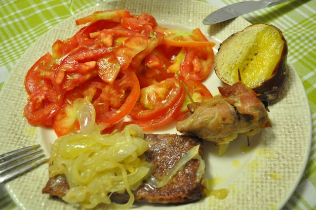
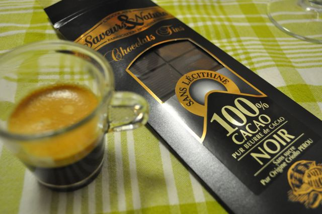

Desde há 2 meses que o meu peso se vem a manter relativamente estável (a partir do momento em que atingi os ~75 Kg), estando a perder gordura a um ritmo mais lento (cerca de 0.5 Kg por mês). Uma vez que ainda tenho algumas "reservas" para abandonar, tenho sido mais rigoroso (nas últimas 3 semanas) e consumido (ainda) menos hidratos de carbono (reduzi a quantidade de fruta e de leguminosas).  
  
Além disso, ando a experimentar o [jejum intermitente](http://www.marksdailyapple.com/how-to-intermittent-fasting/) (por exemplo, estar 24h sem comer uma vez por semana) e tomar banhos de água fria, que segundo alguns estudos e autores, ajudam ultrapassar níveis de estabilização de peso e a reduzir a massa gorda (ver _links_ no fim). Os banhos de água fria, depois de se estar habituado, são extremamente revigorantes e óptimos para acordar.  
  
Hoje (Sábado) foi dia da minha segunda sessão de jejum de 24h, que terminei pelas 22:30. Como na semana passada, o início do dia foi mais difícil mas no fim tarde estava cheio de energia (e pronto para jantar...).  
  
Enquanto tratávamos da Inês e de uns afazeres domésticos, fiz umas bifanas assadas no forno com tâmaras, acompanhadas por batata doce (em quantidade muito reduzida) e salada de tomate.  
  

  
Terminei a refeição com um café e um pedaço de chocolate 100% cacau (biológico).  
  

  
  
  
Links sobre jejum intermitente, banhos e água fria e estabilização de peso  
(1) [http://www.marksdailyapple.com/weight-loss-plateau/](http://www.marksdailyapple.com/weight-loss-plateau/)  
(2) [http://wholehealthsource.blogspot.com/2008/06/hormesis.html](http://wholehealthsource.blogspot.com/2008/06/hormesis.html)  
(3) [http://www.fourhourbody.com/](http://www.fourhourbody.com/)  
  
  
Bifanas com tâmaras, batata doce e salada de tomate  
  
**Ingredientes (2 pessoas)**  
Bifanas de porco, 4  
Tâmaras, 4  
Cebolas grandes, 2  
Batata doce grande, 1  
Azeite, 2 dl  
Tomates maduros, 4  
Sal, q.b.  
Vinagre de vinho tinto, q.b.  
Orégão seco, q.b.  
  
**Preparação**  

1. Ligar o forno nos 180ºC.
2. Retirar os caroços às tâmaras. 
3. Temperar as bifanas com sal e enrolar com uma tâmara cada. Prender com palitos.
4. Cortar as cebolas às rodelas e colocar num tabuleiro para ir ao forno.
5. Regar com metade do azeite e adicionar a carne. Regar a carne com resto azeite.
6. Cortar a batata doce às rodelas e preencher os espaços livres no tabuleiro.
7. Levar ao forno durante 40 minutos (aproximadamente).
8. Servir com uma salada de tomate, temperada com azeite, vinagre de vinho tinto e orégãos.
