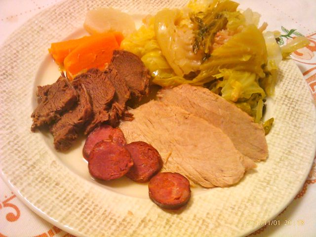

Sou suspeito, mas o meu cozido à Portuguesa favorito é feito pela minha mãe. Não é certamente o melhor, nem o mais completo, nem o mais tradicional, mas no que toca ao sabor... pessoalmente nunca comi um que gostasse mais.

  

A Vânia um destes dias comprou dois pedaços de carne a pensar num cozido simples, que acabei por fazer hoje para o jantar, com os preciosos conselhos (presenciais) da minha querida progenitora. Ficou bom para primeira experiência mas senti a falta do arroz (que é das minhas partes favoritas do cozido... enfim...). Fica a receita.

  

  

  

Cozido à Portuguesa simples

  

Para tornar esta receita mais rápida de elaborar usei uma panela de pressão e um jarro eléctrico para aquecer água. Caso não possua este tipo de equipamento, pode usar uma panela normal. 

  

**Ingredientes (2 pessoas)**

Carne de vaca para cozer, 200 gr. (pode estar congelada)

Carne de porco para cozer, 200 gr.  (pode estar congelada)

Chouriço de carne magro, 1/2

Cenoura, 1

Nabo, 1

Couve coração média, 1

Couve Portuguesa pequena, 1

Sal, q.b.

Água, q.b.

  

**Preparação**

1. Aquecer água no jarro eléctrico.
2. Colocar a carne (excepto o chouriço) dentro de uma panela com uma mão cheia de sal (literalmente) e cubra com água a ferver. Ligar o fogão e levantar fervura. 
3. Entretanto, colocar mais água a aquecer no jarro eléctrico, descascar a cenoura e o nabo, cortar a couve coração em pedaços e separar a couve Portuguesa em folhas (removendo os talos se forem muito grossos).
4. Quando a carne levantar fervura, deitar a água respectiva fora, adicionar o chouriço, a cenoura cortada ao meio, o nabo e duas folhas de couve Portuguesa (para dar sabor). Cobrir com água a ferver, temperar com uma mão cheia de sal (literalmente) e colocar a tampa da panela.
5. Deixar ganhar pressão e depois cozinhar durante 15 minutos, aproximadamente. Desligar o fogão até a panela perder toda a pressão.
6. Retirar todo o conteúdo da panela, com excepção da água, e reservar num recipiente que ajude a manter a temperatura (eu coloquei dentro de uma panela normal com uma tampa).
7. Adicionar as couves à água da cozedura da carne e tapar a panela de pressão.
8. Deixar ganhar pressão e depois cozinhar durante 5 minutos, aproximadamente. Desligar o fogão até a panela perder toda a pressão.
9. Voltar a colocar a carne na panela de pressão, durante 5 ou 10 minutos (com o fogão desligado), para que esta aqueça um pouco.
10. Fatiar a carne e o chouriço e servir com os legumes.
