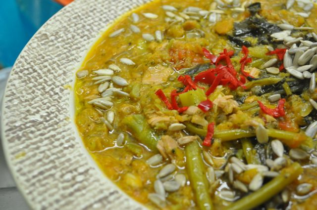

Nem devia fazer este _post_, mas este _blog_ é uma forma de partilha, de coisas boas e menos boas desta vida de "caçador-recolector".

  

Imaginem... semana dura no trabalho, a Vânia num congresso, não janta. Vou buscar a Inês ao infantário. Chego a casa e não tenho vontade para nada. A Inês começa a chorar por causa do sono e por ter fome... É necessário fazer o jantar dela. Coloco peixe e legumes a cozer mas não para mim porque peixe cozido à noite não me "cai bem". Apetece-me uma piza. 

  

"Se calhar consigo fazer uma base para piza com a mesma massa das [crackers](http://www.youtube.com/watch?v=o0_AuRQjn7w)... tenho ali atum e brócolos cozidos para recheio, adiciono um ovo... serve... vou meter a Bimby a fazer molho de tomate enquanto dou o jantar à Inês", pensei. Refogado de cebola, alho, cenoura ralada. Adiciono o tomate, tempero com sal e deixo cozinhar 15 minutos.

  

Dou o jantar à Inês, que termina a chorar novamente, perdida de sono. Lavo-lhe a boca e as mãos, mudo-lhe a fralda e meto-a na cama. Quando regresso à cozinha para tratar da piza, perdi a vontade de ter esse trabalho. 

  

E agora? "Que se dane", pensei. Juntei uma lata de atum e os brócolos cozidos ao molho de tomate, adicionei algum do caldo de legumes que sobrou da cozedura do jantar da Inês, cozinhei 5 minutos. Resultou numa espécie de sopa de tomate com atum e brócolos. Servi com uma malagueta fresca (muito picante), algumas sementes de girassol e um fio de azeite. A surpresa é que até ficou boa. 

  

Fiz este _post_ antes de ir arrumar a cozinha (enfim, melhores dias virão...).

  

