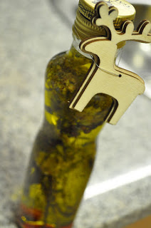
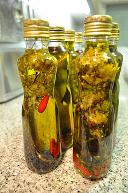

Todos os anos fazemos presentes caseiros, para dar um toque especial e caseiro ao Natal. No ano passado foram bolachas de especiarias ("proibidas" este ano), há dois anos atrás fizemos doce de abóbora.  
  
Este ano resolvemos fazer azeites aromáticos. A maior dificuldade foi arranjar garrafas de vidro. Gastámos no total 22€ para fazer 8 garrafas.  
  

 

  

 

  
Fizemos da seguinte forma.  
  
**Ingredientes**  
  

- Comprámos 8 garrafas de vinagre Gallo (1€ cada uma aproximadamente)
- Comprámos 2 litros de azeite Oliveira da Serra (8€ aproximadamente)
- Ainda tinha 20 malaguetas de há duas semanas atrás do cabaz do Prove
- Comprámos 1 pacote de pimenta preta
- Tinhamos em casa louro
- Tinhamos em casa oregãos ainda com os caules
- Comprámos enfeites natalicios (6€) para as garrafas.

  

**Preparação**

1. Retirar o vinagre das garrafas, os rótolos e lavar as mesmas (na máquina de lavar loiça que ficam logo secas)
2. Colocar dentro das garrafas algumas malaguetas, louro, oregãos e grãos de pimenta, tudo a gosto. Por exemplo, para pessoas que gostam de picante, coloquei uma quantidade maior de malaguetas, traçadas para que o picante das sementes se libertasse com mais facilidade.
3. Fechar com as tampas, lavar as garrafas, secar e enfeitar.
