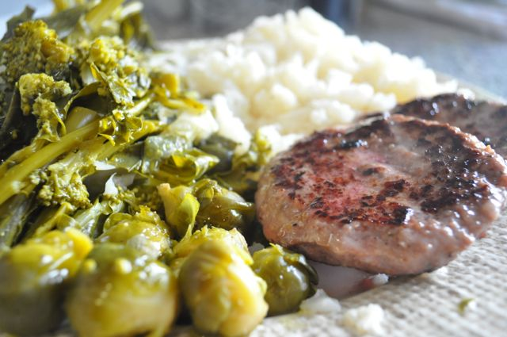
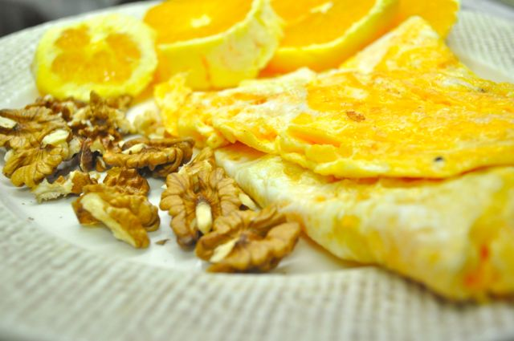
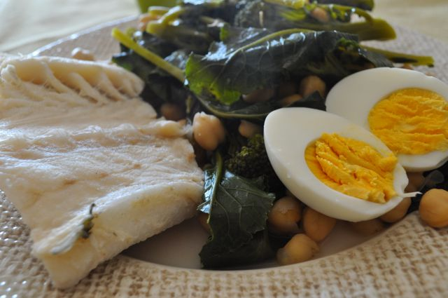
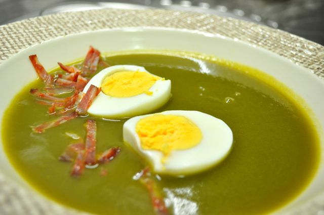

Mais uma semana de muito trabalho, com o Natal à porta (e sem prendas compradas). Na sexta, com um jantar de empresa, tive direito a um "dia de loucura", que já não tinha há duas semanas.  
  
Deixo-vos o plano de refeições que fiz na semana passada, com algumas fotografias.  
  

| _Refeição_ | _Seg_ | _Ter_ | _Qua_ | _Qui (dia de futebol)_ | _Sex (dia da loucura)_ | _Sáb_ | _Dom_ |
| --- | --- | --- | --- | --- | --- | --- | --- |
| _Pequeno-almoço_ | Carne de cozido, queijo, laranja e sementes de girassol | Omelete simples (4 ovos), 5 nozes, laranja (foto em baixo) | [Omelete (3 ovos) com fiambre, sementes de girassol, laranja](http://blog.cozinhadecaverna.com/2011/12/dia-224-video-pequeno-almoco-rapido-1.html) | Iogurte, sementes de girassol, amêndoas e 1 kaki | Fiambre, queijo, pêra, sementes de girassol | Nada | Ovos mexidos, sementes de girassol, 2 tangerinas |
| _Snack Manhã_ | Sementes de girassol, salsicha, chocolate | Sementes de girassol, salsicha | Sementes de girassol, salsicha | Sementes de girassol, salsicha, fruta antes do futebol | Bolo de aniversário, sementes de girassol | Nada | Nada |
| _Almoço_ | Salsichas frescas, brócolos | Salmão com bacon, couve e cenoura cozidas, gelatina | Bifes de peru com canela, brócolos | Lombo de porco assado com salada mista | Febras grelhadas com salada mista | Hamburgers, grelos de couve, brócolos, couves de bruxelas e couve-flôr (foto em baixo) | Bacalhau, grão e brócolos (foto em baixo) |
| _Snack Tarde_ | Sementes de girassol, salsicha | Sementes de girassol, salsicha, gelatina | Sementes de girassol, salsicha | Sementes de girassol | Bolo de aniversário, sementes de girassol | Nada | Nada |
| _Jantar_ | Sopa de legumes, frango assado, couve salteada | Hamburguer, couve-flor e cenoura cozidos, gelatina | Sementes de girassol (noitada no trabalho), gelatina | Costeletas assadas no forno, salada mista (sobras do dia anterior) | Jantar "da loucura" | Frango assado com salada de alface | Creme de coentros com ovo e chouriço (foto em baixo), batata doce, gelatina |
| _Ceia_ | Nada | Gelatina | Entrecosto no forno, cenoura e cebola, nozes, gelatina (quando cheguei a casa...) | Gelatina | Nada | Gelatina | Quadrado chocolate |

  

Hamburgeres com brócolos, grelos, couves de bruxelas e couve-flôr (que pouco cozida e cortada em pedaços pequenos parece arroz)

  

Omelete simples (4 ovos), 5 nozes, laranja

  

Bacalhau cozido com brócolos, grão e um ovo

  

Creme de coentros, ovo cozido e chouriço

