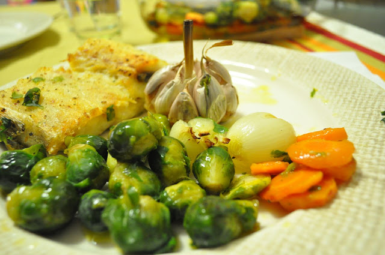
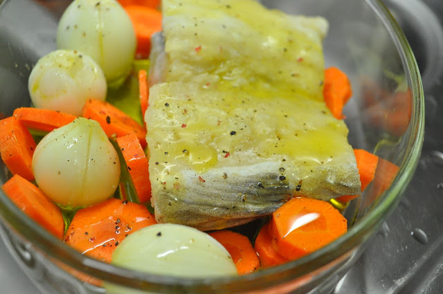

Hoje só tinha de cozinhar para mim e para a Inês. Fiz um arroz de legumes e peixe para ela e um bacalhau com couves de Bruxelas, cenouras, cebolinhas e alho para mim.  
  

  
Bacalhau com 4  
**Ingredientes (para 1 pessoa)**  
Bacalhau, 1 posta :: Couves de Bruxelas, 200 gr. :: Cenoura, 1 :: Cebolas pequenas, 4 :: Alho, 1 cabeça :: Azeite, q.b. :: Pimenta, q.b. :: Sal, q.b.  
  
**Preparação**  

1. Cobrir o fundo de um tabuleiro próprio para ir ao forno com azeite.
2. Descascar a cenoura e cortar em rodelas.
3. Descascar as cebolinhas e fazer dois cortes em cruz.
4. Retirar a camada de fora da pele da cabeça de alho e lavar.
5. Colocar o bacalhau no centro do tabuleiro e rodear com as cebolinhas, rodelas de cenoura e a cabeça de alho.
6. Regar com azeite e temperar com sal e pimenta moída na altura.
7. Levar ao forno durante 45 minutos (aproximadamente).
8. Durante este periodo, cozer as couves de Bruxelas com água e sal. Escorrer bem e adicionar ao bacalhau durante 5 minutos para que as couves ganhem um pouco de cor.

