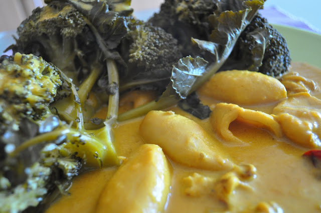

A Inês anda doente e tive de trabalhar de casa para que ela possa recuperar melhor e mais rapidamente. Apesar de ser uma situação menos boa, tem um factor positivo: posso cozinhar para mim.  
  
Hoje, apesar do pouco tempo, consegui fazer um caril de lulas (se é que se pode chamar um caril). Foi a primeira vez que fiz este tipo de receita. Para o tempo que lhe dediquei, ficou aceitável.  
  
Inspirei-me [nesta](http://www.mundodereceitasbimby.com.pt/receitas/4094/caril-de-lulas-moda-do-ze.html) receita, que utiliza a Bimby. No entanto, visto que a confecção é simples, pode facilmente ser replicada num tacho.  
  

  

Caril de Lulas com Brócolos

**Ingredientes (para 2 pessoas)**

Lulas congeladas, 1 embalagem :: leite de coco, 200 mL :: brócolos, 400 gr. :: tomate, 2 :: cebola, 1 :: alhos, 3 dentes :: pimenta, q.b. :: malaguetas secas, 3 :: pimenta da jamaica, 4 grãos :: caril, 2 c. chá :: sal, q.b. :: azeite, q.b.

  

**Preparação**

1. Picar a cebola.
2. Picar o alho.
3. Refogar o alho e a cebola num fio de azeite.
4. Picar o tomate.
5. Adicionar o tomate, o caril, as pimentas, o sal, a malagueta e o tomate e cozinhar 5 minutos.
6. Adicionar as lulas e o leite de coco.
7. Cozinhar durante 40 minutos em lume médio, mexendo de vez em quando.
8. Entretanto, cozer brócolos a vapor.
9. Se o molho estiver demasiado liquido, deixar cozinhar mais um pouco em lume forte, mexendo com frequência.
10. Servir o caril com os brócolos.
