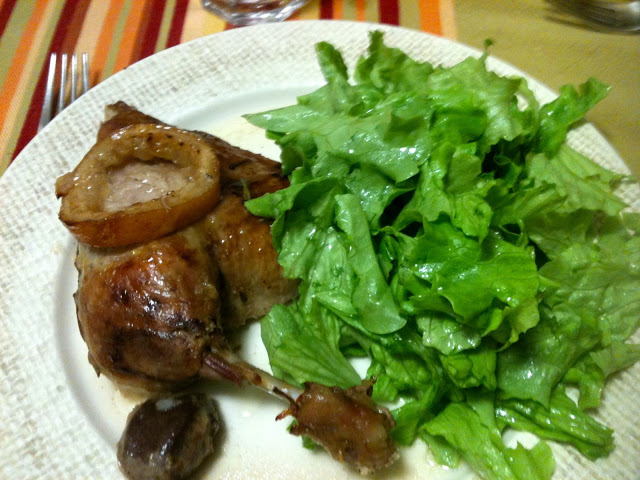

Hoje acordei às 5 a.m. sem conseguir voltar a dormir... aproveito para deixar a receita do jantar de domingo: pato no forno com limão e alecrim. É de confecção muito simples mas requer algum tempo visto que o tempo no forno ainda é grande (optima para fazer num domingo à tarde quando se tem os filhos doentes...). No entanto, a espera compensa visto que a carne fica muito macia e saborosa (a Inês adorou!).  
  

  
  
Pato no Forno com Limão e Alecrim  
**Ingredientes (4 pessoas)**  
pato, 2 kg :: alface grande, 1 :: limão, 3 :: dentes de alho, 3 :: sal, q.b. :: alecrim, q.b. :: azeite, q.b.  
  
**Preparação**  

1. Pré-aquecer o forno a 125 ºC.
2. Cortar o pato em quatro (se tiver as miudezas usar também, as moelas e o pescoço ficam fantásticos).
3. Colocar o pato num tabuleiro para assados no forno.
4. Picar a pele do pato com um garfo.
5. Esmagar num almofariz os dentes de alho, as folhas do alecrim, o sal e um fio de azeite até obter uma pasta.
6. Barrar o pato com a pasta.
7. Regar o pato com o sumo de dois limões (use apenas 1 se quiser um sabor menos intenso a limão).
8. Cortar o limão que sobra em rodelas e colocar por cima do pato.
9. Cobrir o tabuleiro com papel de alumínio.
10. Assar no forno durante 3 horas.
11. Retirar o papel de alumínio e levar ao forno 15 minutos a 175 ºC para tostar.
12. Servir com uma salada simples.
