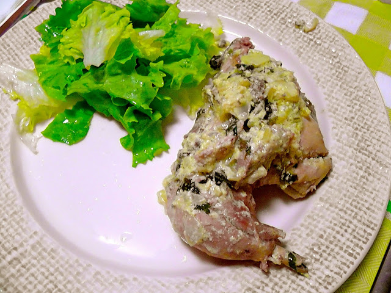

A semana começa bem em termos de jantar: a Vânia fez um fricassé de frango (que eu adoro) acompanhado de uma salada de alface. Fica a receita (de acordo com a avó dela). Só é pena é que as batatas fritas tenham ficado de fora...  

  

  
**Ingredientes (para 2 pessoas)**  
frango, 1 :: salsa, q.b. :: cebola, 2 :: gemas de ovo, 3 :: limão, 1 :: sal, q.b. :: azeite, q.b.  
  
**Preparação**  

1. Retirar a pele ao frango e cortar o mesmo em pedaços.
2. Cozer o frango com uma cebola inteira, sal e um ramo de salsa.
3. Reservar o frango.
4. Reservar três conchas de sopa do caldo da cozedura.
5. Colocar as gemas de ovo, salsa picada e sumo de meio limão numa taça e bater ligeiramente.
6. Num tacho alourar uma cebola picada em azeite.
7. Adicionar o caldo reservado e deixar levantar fervura.
8. Deixar arrefecer até ficar morno. 
9. Adicionar o preparado com as gemas ao caldo, mexer bem e deixar levantar fervura, para terminar o fricassé.
10. Adicionar o frango e deixar cozinhar durante 5 minutos.
11. Servir de imediato com uma salada de alface simples.
