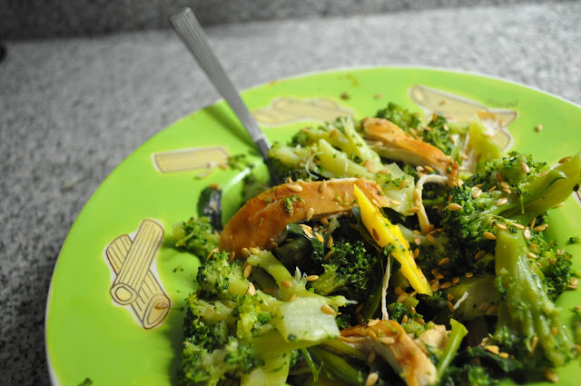

**English Translation**: click [here](http://translate.google.pt/translate?hl=pt-PT&sl=pt&tl=en&u=http%3A%2F%2Fblog.cozinhadecaverna.com%2F2012%2F02%2Fdia-280-frango-com-brocolos-calientes-e.html%3Fv%3D0).  
  
Hoje cheguei tarde e a Vânia tinha grelhado uns peitos de frango. Sem me apetecer salada, acabei por utilizar um resto de brócolos que tinha no frigorifico e um pedaço de manga que a Inês não comeu, para "compor" o jantar. Salteei os brócolos com malagueta cujo picante contrastou bastante bem com a frescura da manga. Deixo os detalhes.  

  

  

  

Frango com brócolos "calientes" e manga

**Ingredientes (1 pessoa)**

peito de frango, 1 :: brócolos, 300 gr :: manga, 1/2 :: azeite, q.b. :: malagueta fresca, 2 :: sementes de linhaça, 1 c.sopa :: sal, q.b. :: pimenta, q.b.

  

**Preparação**

1. Cozer os brócolos com água e sal.
2. Cortar o peito de frango ao meio e grelhar.
3. Picar as malaguetas.
4. Aquecer azeite numa frigideira e adicionar as malaguetas.
5. Saltear os brócolos no azeite.
6. Rectificar os temperos com sal e pimenta.
7. Cortar a manga em pedaços pequenos.
8. Desfiar o frango.
9. Servir o frango com os brócolos e a manga, "salpicados" com as sementes de linhaça.
