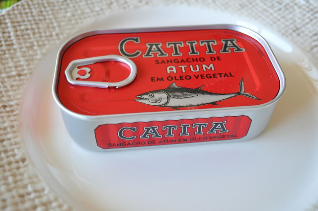
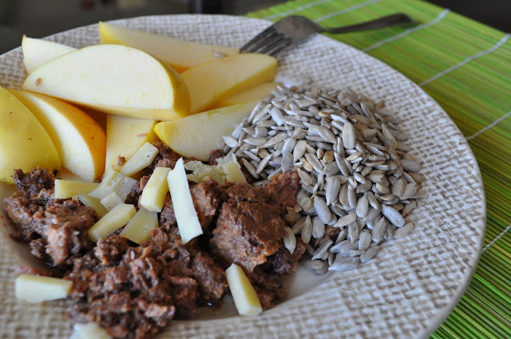

Nos últimos tempos o atum de conserva tem feito parte dos meus pequeno-almoços. Decidi por isso, experimentar todas as marcas disponíveis no supermercado, para conhecer os diversos tipos de produto existentes.

  

Esta semana comprei quatro tipos distintos dos quais falarei durante os próximos dias. Após a compra descobri um [estudo da Deco](http://www.deco.proteste.pt/seguranca-alimentar/20100701/teste-a-atum-Attach_s603741.pdf) sobre atum de conserva, que posteriormente vou utilizar para escolher melhor as marcas a adquirir (para as próximas duas semanas já vou tarde).

  

A prova número 1 incidiu no **Sangacho de Atum Catita**. Nunca tinha provado esta marca nem mesmo sangacho. Servi com sementes de sésamo, uma maçã Golden e uns cubos de queijo da ilha (foto em baixo). 

  

**Conclusão:** Não gostei. O sangacho é muito farinhento e o sabor não é o melhor. Os restantes elementos do pequeno-almoço safaram a refeição.

  
  
  

