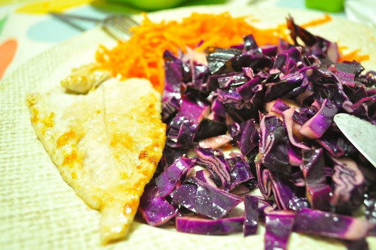

Estou a deixar esta simples receita por um motivo "especial": um tempero de couve-roxa que a Vânia aprendeu com a cozinheira do local onde costuma almoçar. Consiste em mel, canela, azeite e vinagre. Ficam os detalhes.  
  

  

Bife de perú com couve-roxa "especial" e cenoura ralada

**Ingredientes (2 pessoas)**

couve roxa média, 1/2 :: cenoura, 2 :: bifes de perú, 3 :: dentes de alho, 3 :: mel, 1/2 c.sopa :: canela, 1 c. chá :: azeite, q.b. :: vinagre, q.b. :: sal, q.b.

  

**Preparação**

1. Esmagar os dentes de alho.
2. Aquecer duas colheres de sopa de azeite numa frigideira com os alhos.
3. Temperar os bifes com sal.
4. Fritar os bifes no azeite e alho.
5. Ralar as cenouras.
6. Cortar a couve roxa o mais fino possível.
7. Temperar a couve com azeite, vinagre, canela e o mel. Envolver bem.
8. Servir os bifes com a couve e a cenoura.
