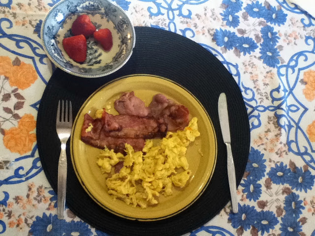
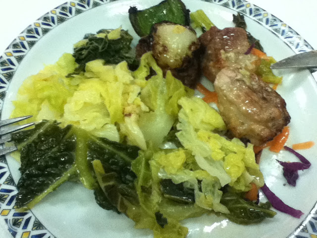
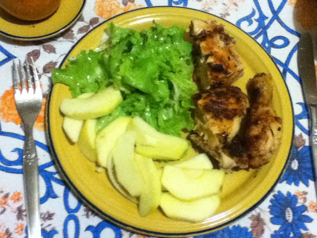

Olá a todos.   
  
  
O autor deste blog permitiu-me que publicasse aqui um diário do programa Whole30, que inicio hoje. É a minha primeira aventura para mudar os meus hábitos alimentares. Vamos lá a ver como corre.

  
  
Estou a iniciar este programa com 105 Kg. Não vou voltar a pesar-me senão no fim. De qualquer modo, não tenho grandes ilusões de que a minha balança me vá dizer algo de diferente. Há anos que me diz sempre a mesma coisa. Suspeito que a mola já deve estar viciada.

  

Hoje comi:

  

Pequeno Almoço - Ovos mexidos com bacon, morangos e sementes de girassol.

  

  

Almoço - Espetada de carne com legumes cozidos. Acompanhado com água (credo!).

  

  

Lanche - Sementes de Girassol.

  

Jantar - Frango assado com alface e maçã. E água. Sobremesa de passas de uva.

  

  

E pronto. One down, 29 to go.
