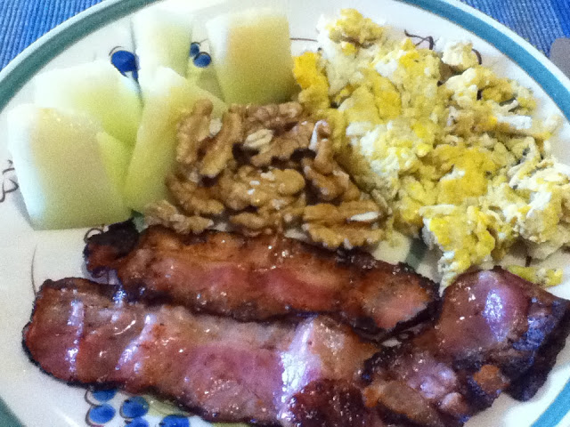

E foi o segundo dia! E quatro refeições acompanhadas a água. O que, para quem está habituado, desde a mais tenra idade, a acompanhar as refeições com vinho (com a excepção notável do pequeno-almoço), é obra! Perde-se na noite nebulosa da memória da minha vida a última vez que pude afirmar tal coisa. Nem estando a antibióticos!

  

Hoje comi:

  

Matabicho: Novamente ovos mexidos, desta vez à preguiçoso (directamente na frigideira) com bacon, agora com melão e nozes. Passada uma hora deu-me fome. Comi umas amêndoas e bebi um café.

  

  

  

Almoço: Salmão grelhado com bróculos.

  

  

Lanche: Umas amêndoas (hoje era o que tinha).

  

Jantar: Depois de um aperitivo de algumas sementes de abóbora, Peixe espada com legumes (hoje foi dia de peixe).

  

  

  

Fim do programa em D-28 dias.
