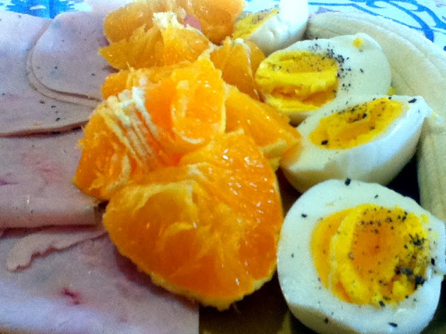
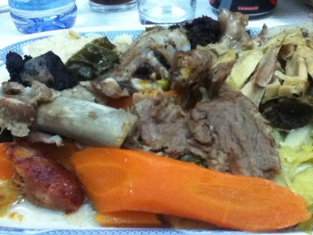
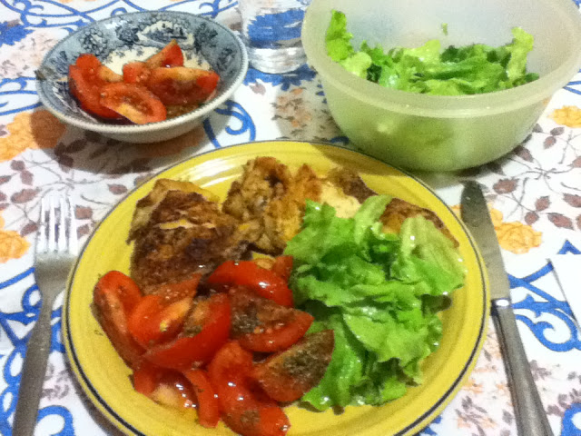

Terceiro dia. Ando a puxar pela cabeça para inventar pequenos-almoços. Este programa é uma parábola que demonstra a diferença em fazer cada dia o mesmo que se fez ontem e no dia anterior (comer torradas e café com leite) e ter de ser criativo quando se pretende mudar alguma coisa na vida. Como nunca liguei nenhuma à alimentação e à saúde em geral, seria irónico que viesse a descobrir que a mudança de vida pode começar precisamente pelo que se come. Mas não nos precipitemos, que a procissão ainda vai no adro.

  

Hoje comi:

  

Pequeno almoço: Fatias de peito de peru com ervas, ovos cozidos, banana e laranja. Amêndoas e café a meio da manhã.

  

  

Almoço: Cozido à Portuguesa, sem batatas, sem feijão e sem farinheira. O arroz veio no prato mas não o comi. Mais amêndoas a meio da tarde (tenho que começar a lembrar-me de levar outras coisas).

  

  

  

Jantar: Frango assado com salada de alface e tomate. E umas sementes de abóbora.

  

Fiz entretanto uma encomenda de cápsulas de Ómega-3. Tenho agora de começar a ver se consigo dormir 7 horas por dia, o que também não é evidente.
