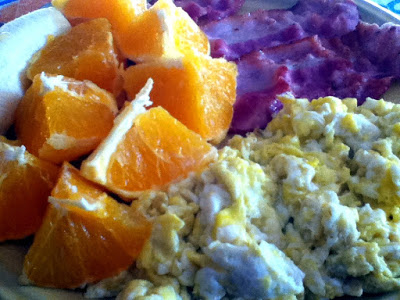
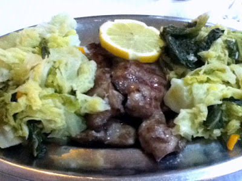
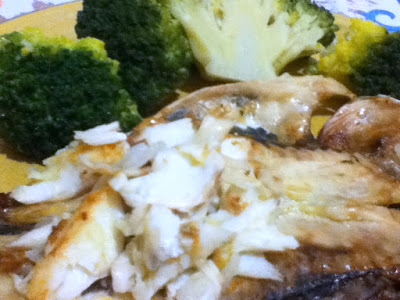

Hoje não tive muito tempo para inventar pequenos-almoços. Fiz o que estava à mão porque tinha de me despachar depressa. O que também não é mau, porque é um pequeno-almoço de que gosto bastante e que me deixa bastante satisfeito. O almoço é no restaurante do costume. Comer frequentemente no mesmo sítio tem algumas vantagens. Já toda a gente me conhece e já estão habituados a não me trazer batatas ou arroz. O jantar também foi na casa do costume (que é onde moro). Aqui também já conhecem os meus hábitos (até bem demais).

  

Hoje comi:

  

Pequeno-almoço: Ovos mexidos com bacon, laranja e meia-banana.

  

Almoço: Febras de porco preto com legumes cozidos. Morangos de sobremesa.

  

Jantar: Dourada Grelhada com bróculos. A dourada era pequena para a fome que trazia, pelo que tive de complementar com nozes e avelãs.

  

As amêndoas continuam a ser as minhas companheiras durante o dia. Amanhã vou ver se diversifico.
