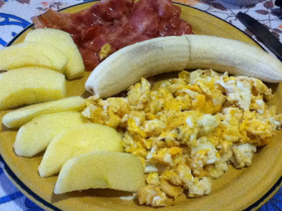
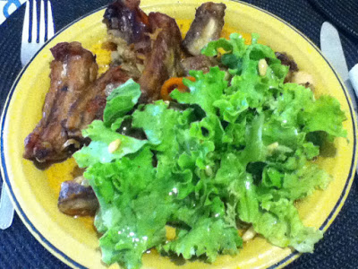
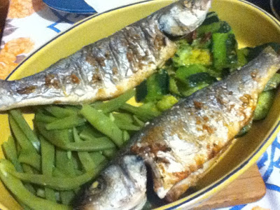

É o 6º dia deste programa. Ao contrário do que poderia esperar, não me custou nada até aqui. E não toquei num pão, nem leite, nem manteiga, nem queijo, nem batata, nem arroz, nem vinho, nem bolos, chocolate ou açucar de qualquer espécie. Talvez seja por pensar nisto como algo de finito no tempo. Esta alimentação não é sustentável (para mim, pelo menos). No entanto, este programa, limitado no tempo, poderá ser um bom ponto de partida para algo de saudável e sustentável. Quanto a aguentar o programa até ao fim... a ver vamos.

  

Hoje comi:

  

Pequeno-almoço: Ovos mexidos e bacon (começa a ser um standard), maçã e banana.

  

Almoço: Piano com salada.

  

  

Jantar: Robalo grelhado com feijão-verde e corgettes salteadas com malaguetas.

  

