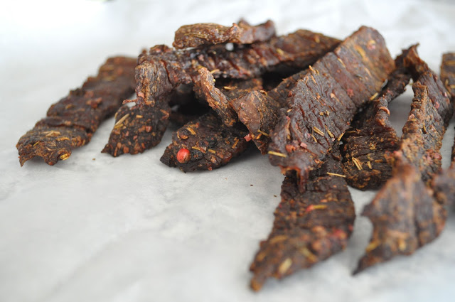
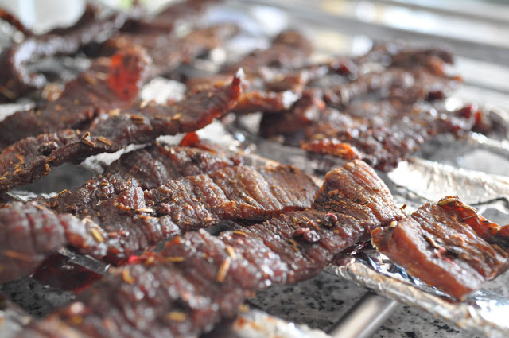

**English translation below the images.**  
  
Este fim-de-semana resolvi finalmente experimentar fazer _jerky_, para usar como _snack_ durante a semana. _Jerky_ consiste básicamente em carne com muito pouca gordura que é marinada em especiarias e seca a baixa temperatura.  
  
Tinha duas questões principais na preparação: que tempero utilizar, pois não tinha alguns dos ingredientes das receitas que arranjei (por exemplo, _liquid smoke_) e como saber o ponto de secagem da carne. Acabei por fazer tudo "a olho" e acho que ficou aceitável. Depois de provar, retiraria os cominhos em pó. Deixo os detalhes.  
  
Pedi no talho 400 gramas de carne de vaca (pouca quantidade para não correr riscos) o mais magra possível (já não sei de que parte era, mas eu não consegui ver gordura ou nervos). Aproveitei que o talhante é muito prestável e pedi-lhe que cortasse a carne em tiras de 2 ou 3 milímetros.  
  
Para o tempero, usei:  

- Molho Worcestershire, 3 c. sopa
- Cominhos em pó, uma pitada
- Gengibre em pó, 1 c. chá
- Vinagre balsâmico, 1 c. sopa
- Alecrim, 1 c. chá
- Ervas provence, 1 c. chá
- Bagos de pimenta vermelha, 2 c. chá
- Pimenta preta moída no momento, 1/2 c. café
- Azeite, 3 c. sopa
- Sal, 1 c. café

Deixei marinar durante a noite (das 20h às 11h). Aqueci o forno a 90ºC e coloquei as tiras de carne na numa das grelhas do forno. Coloquei a carne no forno e deixei secar durante 4 horas, virando de vez em quando as tiras.

  
  

  
  

  

  

**Translated using Google Translator**

  

This weekend, I decided at last to try to make jerky, to use as a snack during the week. Jerky is basically very low fat beef marinated in spices and dried at low temperature.

  

I had two main issues in the preparation, the spices to use, because I didn't had some of the ingredients of the recipes that I got (for example, liquid smoke) and how to know the drying  point of meat. I ended up doing all by guessing and I think the end result was acceptable.

  

Ask the butcher 400 grams of beef (I asked a little amount to reduce the risks) as lean as possible (I do not know that part it was from, but I could not see fat or nerves). As the butcher was very helpful, I asked him to cut the meat into 2 or 3 mm strips.

  

For seasoning, I used:

- Worcestershire sauce, 3 tbsp
- Cumin powder, a pinch
- Ginger, 1 tsp
- Balsamic vinegar, 1 tbsp
- Rosemary, 1 tsp
- Provence Herbs, 1 tsp
- Red pepper, 2 tsp
- Black pepper, 1/2 tsp
- Olive oil, 3 tbsp
- Salt, 1/2 tsp

  

  

Let marinate overnight (8 p.m. to 11 a.m.). Heat the oven at 90 ° C and put the strips of meat on a grill of the oven. Put the meat in the oven and let dry for 4 to 6 hours, turning occasionally the strips.
