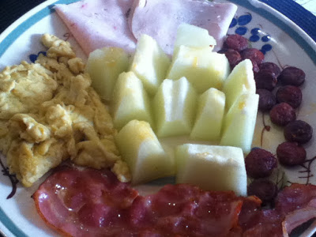
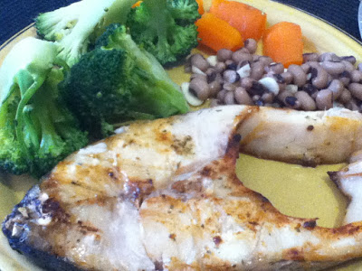
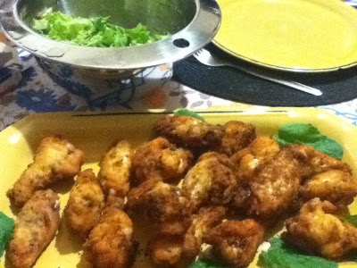

Completa-se hoje uma semana do programa. Hoje confesso, a bem da transparência e da honestidade (valores muito deficitários nos dias que correm), que comi um quadradinho de chocolate. Fi-lo por várias razões: Primeiro, "pour m'offrir un petit cadeau". Chamem-lhe uma pequena comemoração por uma semana de dieta. Segundo, para que não vá o meu pancreas esquecer-se de como produzir insulina. E terceiro, porque era um chocolate suiço oferecido ao meu filho mais novo, e partilhar essa delícia com ele era irrecusável (hehe). Curiosamente, não tive a compulsão que teria normalmente de abifar o chocolate todo. Comer poucas coisas doces é, de facto, uma questão de hábito.

  

Hoje comi:

  

Pequeno-almoço: Linguiça salteada com fatias de peito de peru e melão. Ah, e ovos mexidos com bacon...

  

Almoço: Perca grelhada com bróculos, cenouras e feijão.

  

Jantar: Asas de frango com salada.

  

Um quarto do projecto concluído. Faltam mais três.
