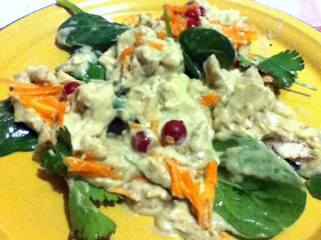
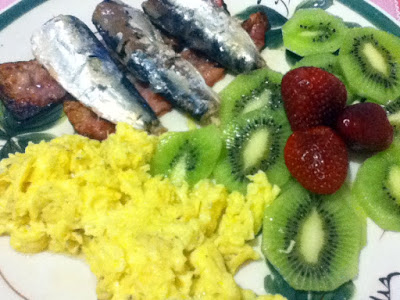
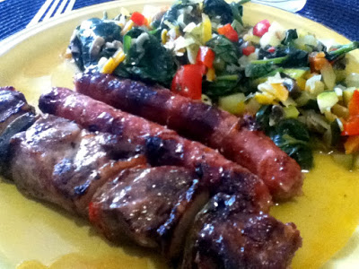
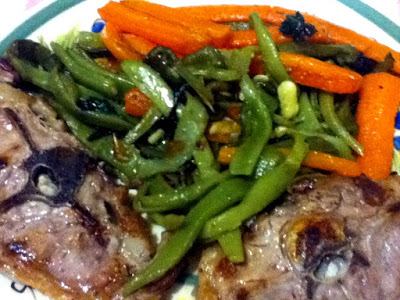

  

E foi a segunda semana do "Whole30". Alguns puristas dirão que talvez não possa afirmar tratar-se de um verdadeiro "Whole30", uma vez que comi um quadradinho de chocolate no Domingo passado e possa ter também comido uma ou outra coisa proíbida, como um frango com abacate que levou um pouco de natas e groselha... mas eu não sou fundamentalista nem estou aqui para bater recordes. De qualquer modo, se não posso afirmar que a roupa deixou de me servir, o que é certo é que começo a sentir-me melhor. Tenho menos azia, sinto um pouquinho mais de energia e mais bem estar geral. O que, para apenas duas semanas, não me parece nada mal. Talvez haja quem tenha experimentado resultados mais espectaculares, mas no meu caso, com 22 anos de barriga, esta mudança, por pequena que seja, é por mim sentida como muito positiva.

  

  

Os posts diários com imagens da primeira semana transmutaram-se neste post semanal, porque o tempo também não abunda. Os pequenos almoços não têm variado muito, tendo sido muito na base dos ovos mexidos com bacon. Os almoços durante a semana são nos restaurantes, o que mostra que não é difícil adaptarmos a maioria dos pratos normalmente servidos. Entre refeições tenho comido normalmente amêndoas, avelãs, caju, sementes ou fruta. E comecei agora também a comer aquela gelatina 10kcal da Royal que é uma delícia (passe a pub).

  

  

O registo das principais refeições da semana foi o seguinte:

<table border="1" width="100%"><tbody><tr><td><b>Refeição</b></td><td><b>Segunda</b></td><td><b>Terça</b></td><td><b>Quarta</b></td><td><b>Quinta</b></td><td>
 
<b>Sexta</b></td><td><b>Sábado</b></td><td><b>Domingo</b></td></tr><tr><td style="text-align: left;"><b>Pequeno Almoço</b></td><td style="text-align: left;">Ovos mexidos, bacon, linguiça e maçã</td><td style="text-align: left;">Ovos mexidos com bacon, linguiça, fatias de peru e melão</td><td style="text-align: left;">Ovos mexidos com bacon e banana</td><td style="text-align: left;">Ovos mexidos com amêndoa, presunto e laranja</td><td style="text-align: left;">Ovos mexidos, bacon e sardinhas de conserva em oleo picante, kiwi e morangos</td><td style="text-align: left;">Ovos mexidos com amêndoas laminadas, bacon, presunto, banana e kiwi</td><td style="text-align: left;">Ovos mexidos com sementes de girassol e oregãos, bacon, presunto, amêndoas e laranja</td></tr><tr><td><b>Almoço</b></td><td>Carne de porco com ananás</td><td>Cabrito no churrasco com grelos</td><td>Cozido à Portuguesa, sem batatas, arroz ou farinheira</td><td>Carne de porco com salada</td><td>Rodízio de carnes, acompanhado com legumes</td><td>Espetada de carne com legumes salteados</td><td>Perca Grelhada com feijão verde e cenouras cozidas</td></tr><tr><td><b>Jantar</b></td><td>Dourada grelhada com presunto e bróculos</td><td>Borrego grelhado com legumes salteados</td><td>Sopa e Bacalhau grelhado com espinafres</td><td>Pargo mulato no forno com legumes</td><td>
Frango com pera abacate
</td><td>Robalinho grelhado com legumes salteados</td><td>Bifes de peru e vaca com salada</td></tr></tbody></table>

  

  

E cá vou eu entrar na terceira semana. Uma coisa posso afirmar: fazer esta dieta é muito mais fácil do que parece. Só não digo que é um "piece of cake" porque os bolos são proibidos.
