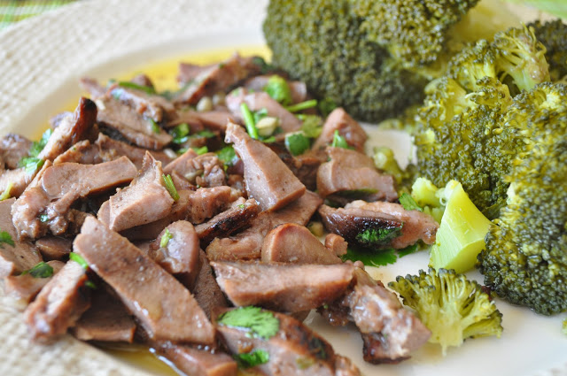

Adoro língua de porco. Um destes dias comprei no talho e resolvi fazer ontem, estilo petisco, acompanhado de uns belos brócolos (nham nham). Fica a receita.  
  

  

Língua de porco grelhada de coentrada com brócolos

**Ingredientes (1 pessoa)**

Língua de porco fatiada, 1

Brócolos, 200 gr

Azeite, q.b.

Alhos, q.b.

Coentros, q.b.

  

**Preparação**

1. Temperar a língua com sal e grelhar num grelhador ou chapa de forno.
2. Entretanto, preparar uma taça com alhos e coentros picados, azeite e vinagre.
3. Cortar a língua em pedaços pequenos e juntar ao molho de coentros.
4. Servir com brócolos cozidos a vapor.
