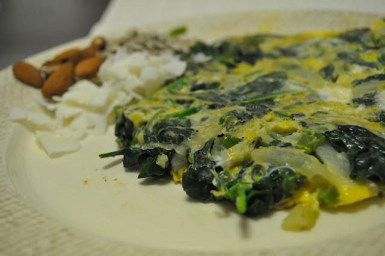
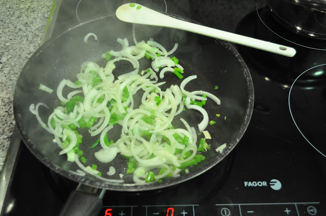
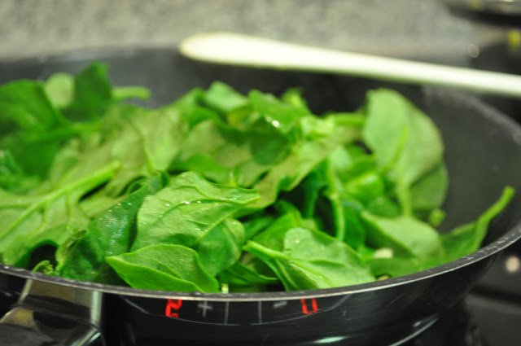
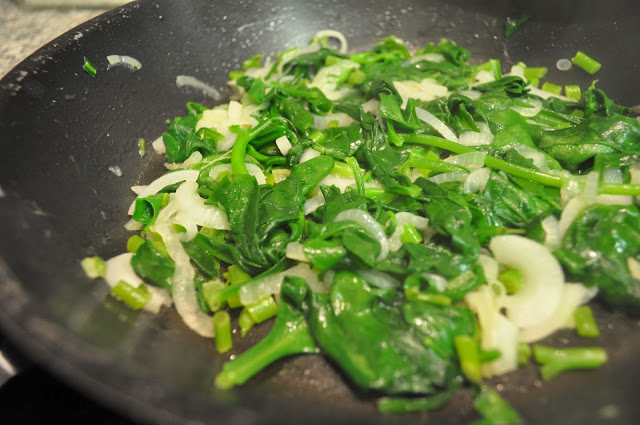

Hoje acordei cedo e com vontade de fazer uma tortilha. O resultado está em baixo.

  

  

Tortilha de espinafres e cebola

**Ingredientes (1 pessoa)**

pimenta q.b. :: sal q.b. :: azeite q.b. :: cebola, 1:: espinafres, 100 gramas :: ovos, 2 

  

**Preparação**

1\. Separar as folhas do espinafre dos caules (se estes últimos forem grossos); 

2\. Picar os caules dos espinafres; 

3\. Picar a cebola; 

4\. Saltear a cebola e os caules de espinafres em azeite; 

5\. Adicionar as folhas dos espinafres e deixar cozinhar (2 ou 3 minutos); 

6\. Bater os ovos numa taça, juntar os espinafres e envolver rapidamente, adicionar sal e pimenta; 

7\. Colocar tudo de volta na frigideira para cozinhar os ovos; 

8\. Voltar a tortilha com a ajuda de um prato. 

9\. Servir com algumas amêndoas, sementes de girassol e lascas coco (opcional)

  
  

  

  

  

