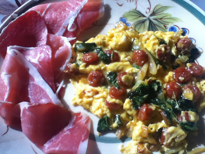
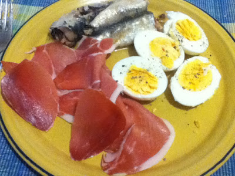
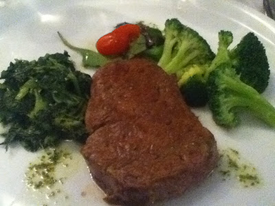

Se alguma coisa aprendi nesta semana que possa ser útil a quem pretenda experimentar este programa foi o seguinte: nunca o iniciar perto da Páscoa, do Natal ou outras ocasiões que se prestem a reuniões familiares. De facto, esta semana as prevaricações foram tantas que já não se pode falar de um verdadeiro "Whole30". Entre elas houve um pouco de vinho, um pouco de queijo, um pouco de folar... mas a experiência tem cumprido com o essencial do seu objectivo: mudar os meus hábitos alimentares e preparar-me para aceitar, não uma dieta, mas uma forma diferente e mais saudável de me alimentar. Esta será acompanhada por um nutricionista, como me parece aconselhável para quem queira mudar a sua alimentação depois de décadas daquilo a que está habituado.

  

Não me parece viável que um tipo de alimentação, seja ela qual for, não possa permitir de vez em quando alguns excessos e contemporizações com as tradições do local onde se vive. Por esse motivo recuso o vegetarianismo, o veganismo e outras excitações da mesma estirpe, muitas vezes fundamentadas em questões ideológicas (não mato nem como animais), psicológicas (não como animais desde que vi o meu cão ser atropelado) ou religiosas (não como carne de porco - muçulmanos - ou vaca - hindús). Comer bem é essencial, sim, mas também tem de haver festa!

  

O registo das principais refeições da semana foi o seguinte:

<table border="1" width="100%"><tbody><tr><td><b>Refeição</b></td><td><b>Segunda</b></td><td><b>Terça</b></td><td><b>Quarta</b></td><td><b>Quinta</b></td><td><b>Sexta</b></td><td><b>Sábado</b></td><td><b>Domingo</b></td></tr><tr><td style="text-align: left;"><b>Pequeno Almoço</b></td><td style="text-align: left;">Ovos mexidos com sementes de girassol, bacon, presunto kiwi e amendoas</td><td style="text-align: left;">Ovos mexidos com sementes de girassol, bacon e pera</td><td style="text-align: left;">Ovos cozidos com presunto e sardinhas de conserva</td><td>
Omelete com linguiça e espinafres, presunto
</td><td style="text-align: left;">Omelete com presunto e tomate cherry, sardinhas de conserva</td><td style="text-align: left;">Omelete com bacon, kiwi</td><td style="text-align: left;">Empada de galinha com sumo natural de cenoura e laranja</td></tr><tr><td style="text-align: left;"><b>Almoço</b></td><td style="text-align: left;">Caril de frango com couve lombardo e bróculos. Morangos.</td><td style="text-align: left;">Ovas de pescada no churrasco com couve</td><td style="text-align: left;">Cozido à Portuguesa, sem batatas, arroz ou farinheira</td><td style="text-align: left;">Não almocei</td><td style="text-align: left;">Dourada grelhada com feijão verde</td><td style="text-align: left;">Carnes grelhadas com salada</td><td style="text-align: left;">Ameijoas à Bolhão Pato. Bacalhau com grão.</td></tr><tr><td style="text-align: left;"><b>Jantar</b></td><td style="text-align: left;">Bacalhau grelhado com grão e salada de espinafres. Gelatina.</td><td style="text-align: left;">Solha grelhada com legumes salteados</td><td style="text-align: left;">Carne de novilho com salada de agrião, beterraba e morango</td><td>
Bochechas de porco preto com grelos
</td><td style="text-align: left;">Bife grelhado com espinafres e broculos</td><td style="text-align: left;">Pescada cozida com broculos</td><td style="text-align: left;">Carne de porco com salada. Gelatina.</td></tr></tbody></table>

  

E entro agora na recta final: a última semana do programa, não o puro, mas o que se pôde arranjar. Até para a semana!
