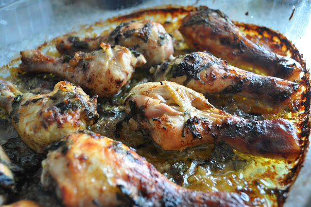
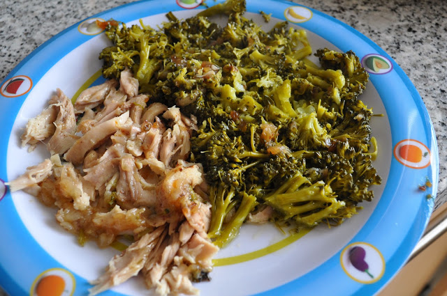
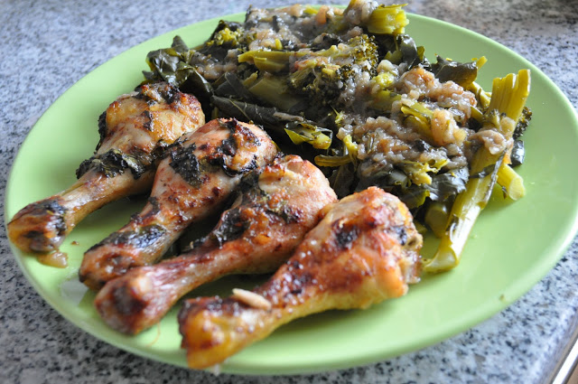

A Inês está doente doente e eu de "enfermeiro". Para o nosso almoço, necessitava de algo rápido de fazer. Tinha uma embalagem de pernas de frango e muito vegetais pelo que decidi fazer creme de coentros e pernas de frango com coentros, hortelã e canela, acompanhados de brócolos a vapor. Fica a receita do frango.  
  

No tabuleiro

  

A versão Inês

  

A minha versão

  

Pernas de frango com coentros, hortelã e canela

  

**Ingredientes**

pernas de frango, 10 

cebola, 2 

molho de coentros, 1 

molho de hortelã, 1 

canela, 1 colher(es) de sopa

azeite, 2 dl

sal, q.b.

brócolos, 600 gramas

  

  

**Preparação**

1\. Picar a cebola e dispor num tabuleiro para assados de forno com metade do azeite 

2\. Picar os coentros e a hortelã e colocar uniformemente no tabuleiro 

3\. Temperar as pernas com sal e colocar no tabuleiro 

4\. "Salpicar" com a canela 

5\. Regar com o restante azeite 

6\. Levar ao forno pré-aquecido a 180º por cerca de 45 minutos 

7\. Virar as pernas a meio da cozedura 

8\. Servir com brócolos cozidos a vapor
