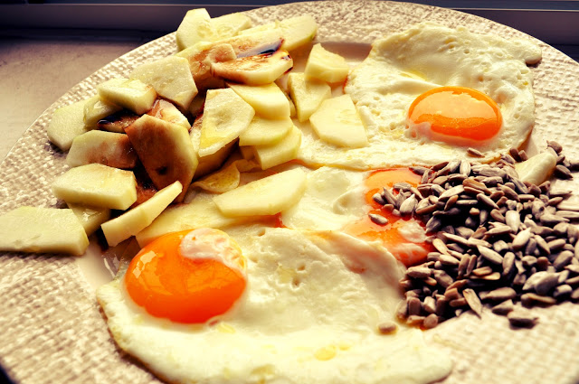

  
Salada de cenoura com presunto, queijo de cabra curado, maçã e sementes de girassol

  
  

Entrecosto no forno com castanhas (sobras do jantar) e meloa

  

  

Ovos estrelados em manteiga clarificada e picante algarvio com salada de tomate cherry, meloa e sementes

  
  

Mozzarella de bufala e figos

  

  

Ovos mexidos com maçãs "anãs" e sementes

  

Bifes de cebolada (sobras do jantar) com tomate e pepino.

  

Ovos estrelados, salada de pepino e sementes

