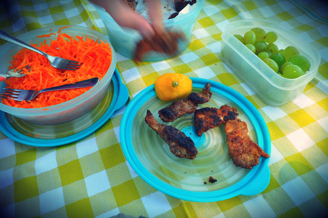
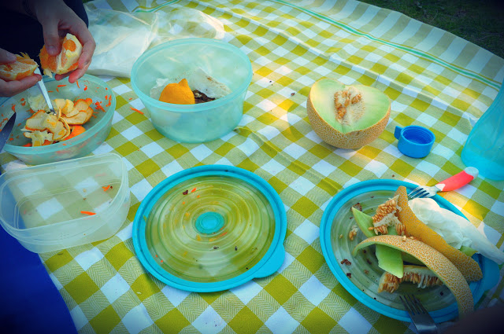
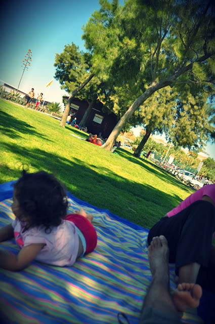
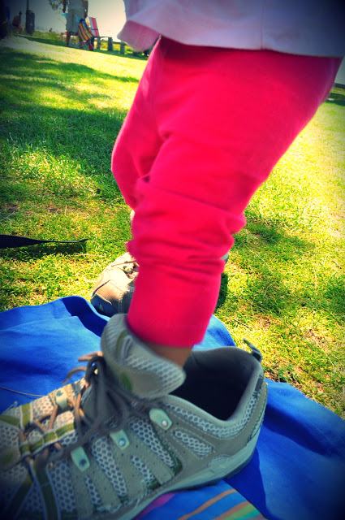
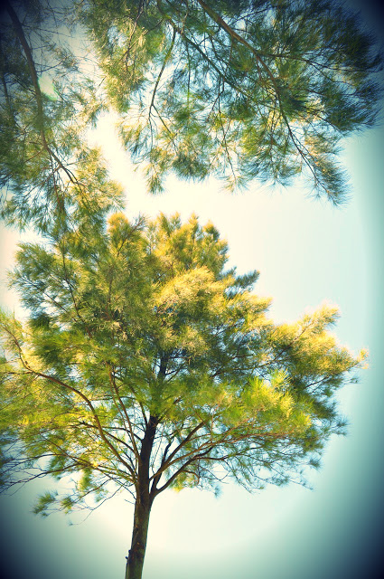

Decidimos um destes sábados que iríamos fazer um piquenique rápido para o almoço de domingo. Acordei mais cedo, e enquanto as senhoras cá da casa ainda dormiam, piquei dois ou três punhados de amêndoas e sementes de girassol (as únicas coisas que tinha que podiam dar "farinha"). Cortei bifes de peru e peitos de frango em tiras. Temperei com sal (limão também tinha ficado bem mas tinha-se acabado...). Entretanto a Inês acordou, dei-lhe o pequeno-almoço e deitámos mãos à obra. Azeite quente numa frigideira, dois ou três ovos batidos num prato, farinhas noutro. "Vá filha, passa a carne no ovo, assim, assim, espera, com as duas mãos não, ai o chão, o pai ajuda... agora na farinha, de um lado, agora do outro, sacode bem, dá ao pai". Frigideira. Colocar em papel absorvente. Repetir até acabar a carne. "Prova filha" ("Nham nham bom pai... Maís!").

  

Ralar cenoura, lavar uvas, tirar a meloa do frio, duas laranjas, colocar tudo em caixas, água fresca, 3 garfos e uma faca, guardanapos de papel, uma toalha e uma manta, o livro da "mosca fosca", fraldas e toalhetes, tudo em dois sacos. Comprar limões pelo caminho "para salpicar" os panados.

  

Dos melhores almoços dos últimos tempos, sol q.b., praia, relva, sombra, brincadeira, descanso. Ahhhhh.

  

  

  

  
  

