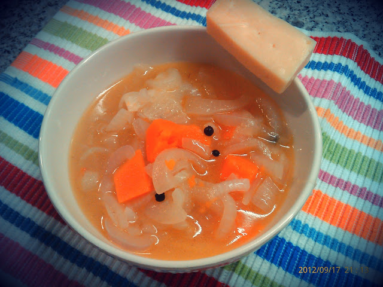
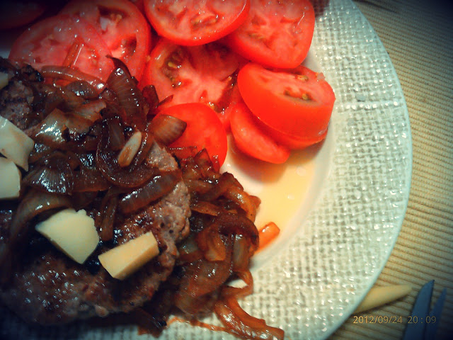

  

Nas últimas semanas o tempo tem sido curto para tudo. Tem sido coincidência, quando me apanho sozinho em casa, em dar destaque à cebola e ao queijo da ilha. Deixo dois exemplos: **sopa de cebola e abóbora com naco de queijo da ilha** e **hamburgers com cebola doce e cubos de queijo da ilha**.

  

"Puxar" 2 cebolas em azeite até começarem a ficar louras. Adicionar 1 "mão cheia" de cubos de abóbora, 3 ou 4 grãos de pimenta da jamaica e temperar com sal e pimenta. Saltear durante uns minutos e adicionar á pré-aquecida (para ser mais rápido). Deixar cozinhar bem e acompanhar com um naco generoso de queijo da ilha.

  
  
Numa frigideira saltear 2 cebolas e 2 dentes de alho num pouco de azeite. Reservar. Na mesma frigideira grelhar 2 hamburgers até estarem no ponto desejado. Reservar. Voltar a colocar a cebola na frigideira, temperar com sal e pimenta. Adicionar 1 colher de chá de mel e saltear até ficar bem macia. Servir com uma salada generosa de tomate e 4 ou 5 cubos  de queijo da ilha.  

